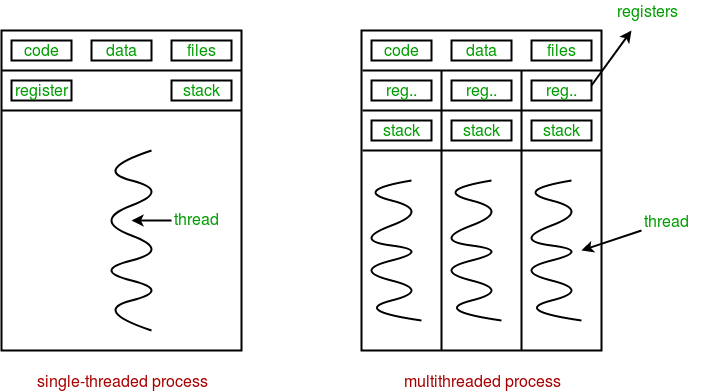
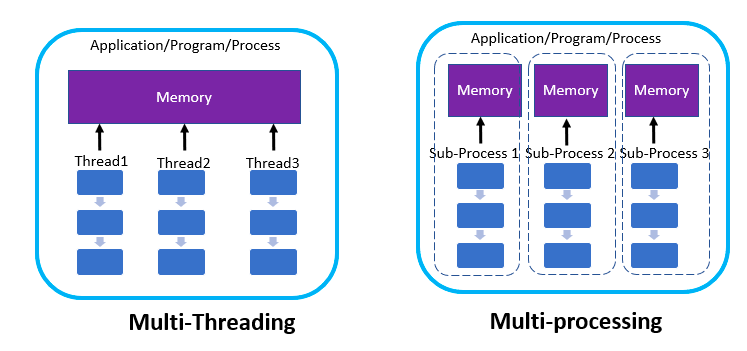

# 멀티 스레드와 멀티 프로세스
## 멀티 스레딩

보통 우리가 작성하는 코드를 실행하면 하나의 프로세스로 동작합니다. 또, 하나의 프로세스는 보통 하나의 스레드만 사용하여 동작합니다. 예를 들면 파이썬 코드로 이를 확인해볼 수 있습니다.

```python
import os
import threading


def run() -> None:
    print(f"process_id: {os.getpid()}")
    print(f"thread_id: {threading.get_ident()}")

if __name__ == "__main__":
    run()
```

위 코드를 실행하면 다음과 같은 결과가 나옵니다.

```bash
process_id: 25939
thread_id: 4539137536
```

이렇게 하나의 프로세스에서 하나의 스레드만 사용하는 것을 "싱글 스레딩"이라고 합니다.
우리가 작성하는 대부분의 코드들은 이렇게 싱글 스레딩입니다.

그런데 하나의 프로세스에서 여러 개의 스레드를 사용할 수도 있습니다. 예를 들면 파이썬에서는 다음처럼 가능합니다.

```python
import os
import threading
from concurrent.futures import ThreadPoolExecutor


def run() -> None:
    print(f"process_id: {os.getpid()}")
    time.sleep(5)  # 5초 동안 대기합니다.
    print(f"thread_id: {threading.get_ident()}")


# run 함수를 실행하는 2개의 스레드를 띄웁니다.
if __name__ == "__main__":
    with ThreadPoolExecutor() as executor:
        n_threads = 2
        for _ in range(n_threads):
            executor.submit(run)
```

위 코드를 실행한 결과는 다음과 같습니다.

```python
process_id: 27180
process_id: 27180  # 같은 프로세스에서 생성했으므로, 프로세스 ID는 같습니다.

# (5초 뒤)

thread_id: 123145394302976
thread_id: 123145411092480  # 서로 다른 스레드이므로 스레드 ID는 다릅니다.
```

이렇게 여러 개의 스레드를 사용하는 것을 "멀티 스레딩"이라고 합니다.



멀티 스레딩은 우리가 위에서 배운 "동시성"과 "병렬성"을 구현하는 방법 중 하나입니다. 컴퓨터가 하나의 CPU 코어만 가진 경우 "동시성"이 되고, 여러 개의 코어를 가진 경우 "동시성"과 "병렬성"이 둘 다 구현하는 셈이 됩니다. (여러 개의 CPU코어를 사용하면서 동시에, 각 코어에서 여러 개의 스레드를 컨텍스트 스위칭하며 사용하기도 하기 때문이죠)

그렇다면 멀티 스레딩은 보통 언제 사용하면 좋을까요?
멀티 스레딩을 사용하는 대표적인 경우는 독립적인 I/O Bounded 작업이 많은 경우입니다.

예를 들면 여러 사이트를 크롤링해야 하는 경우, 각 크롤링 작업은 대부분 I/O (해당 서버에 요청하고 응답받기 때문) 작업이기 때문에, 멀티 스레딩을 사용하기 좋습니다. 파이썬 코드로 대략적인 코드를 구현하면 다음과 같습니다.

```python
import requests
from concurrent.futures import ThreadPoolExecutor

def parse(html_string: str) -> None:
    # html 문자를 파싱하는 로직이 들어갑니다.
    pass

def crawl(url: str) -> None:
    # 대부분 I/O Bounded 작업입니다.
    res = requests.get(url)
    parse(res.text)


urls = [
    "https://tansfil.tistory.com/",
    "http://dailyheumsi.tistory.com/",
    "https://zzsza.github.io/",
    "https://www.humphreyahn.dev/"
]

if __name__ == "__main__":
    # 최대 4개의 스레드를 띄워 각 스레드에서 위 주소들을 크롤링합니다.
    # 즉 크롤링(I/O Bounded) 작업이 동시적(concurrency)으로 일어납니다.
    with ThreadPoolExecutor(max_workers=4) as executor:
        for url in range(urls):
            executor.submit(crawl, url)
```

:::tip
**파이썬의 멀티 스레드는 사실 싱글 스레드처럼 동작합니다**

위에서 멀티 스레딩 코드를 구현했지만, 실제로 파이썬 내부적으로 GIL(Global Interpreter Lock)이라는 정책에 따라서 싱글 스레드처럼 동작합니다. 
더 궁금하신 분은 [이 글](https://dgkim5360.tistory.com/entry/understanding-the-global-interpreter-lock-of-cpython)을 참고하세요.

:::
<br>

## 멀티 프로세싱

지금까지 하나의 프로세스만 사용해왔습니다. 이제 프로그램을 실행에 2개 이상의 프로세스를 사용해봅시다. 이를 멀티 프로세싱이라고 합니다.

예를 들면 파이썬 코드로 다음과 같이 구현할 수 있습니다.

```python
import os
import threading
import time
from concurrent.futures import ProcessPoolExecutor


def run():
    print(f"process_id: {os.getpid()}")
    time.sleep(5)
    print(f"thread_id: {threading.get_ident()}")


if __name__ == "__main__":
    with ProcessPoolExecutor() as executor:
        n_processes = 2
        for _ in range(n_processes):
            executor.submit(run)
```

위 코드를 실행하면 다음과 같은 결과가 나옵니다.

```python
process_id: 28394
process_id: 28393  # 서로 프로세스이므로, 프로세스 ID는 다릅니다.

# (5초 뒤)

thread_id: 4612054528
thread_id: 4766633472  # 서로 다른 프로세스 내에서 실행되고 있으므로 당연히 스레드 ID도 다릅니다.
```

멀티 프로세싱은 역시 "동시성"과 "병렬성"을 구현하는 방법 중 하나입니다. 컴퓨터가 하나의 CPU 코어만 가진 경우 "동시성"이 되고, 여러 개의 코어를 가진 경우 "동시성"과 "병렬성"이 둘 다 구현하는 셈이 됩니다.

그렇다면 언제 멀티프로세싱을 사용하면 좋을까요?
멀티 프로세싱을 사용하는 대표적인 경우는 독립적인 CPU Bounded 작업이 많은 경우입니다.

예를 들면 다음처럼 머신 러닝 코드에서 전처리하는 부분을 멀티 프로세싱으로 풀어낼 수 있습니다.

```python
import multiprocessing
from concurrent.futures import ProcessPoolExecutor

import numpy as np


def preprocess(data: np.array) -> np.array:
    # 대부분 CPU Bounded 작업입니다.
    ...

data = np.array([1, 2, 3, 4, 5, 6, 7, 8, 9, 10])
num_cores = multiprocessing.cpu_count() # 12

if __name__ == "__main__":
    # 데이터를 CPU 코어 수만큼 자릅니다.
    splited_data = np.array_split(data, num_cores)

    # 최대 CPU 코어 개수 만큼의 프로세스를 띄워 각 프로세스에서 데이터를 전처리하는 작업을 합니다.
	# 즉 전처리(CPU Bounded) 작업이 병렬적(parallelism)으로 일어납니다.
    with ProcessPoolExecutor(max_workers=num_cores) as executor:
        for data_chunk in splited_data:
            future = executor.submit(preprocess, data_chunk)
            ...
```


## 멀티 스레드과 멀티 프로세스의 차이
 


- 멀티 스레드과 멀티 프로세스의 가장 큰 차이는, "메모리를 공유하는가?" 입니다. 멀티 스레드는 여러 개의 스레드가 하나의 프로세스 안에서 같은 메모리를 사용합니다.
 반면 멀티 프로세스는 각 프로세스가 별도의 메모리 공간을 갖습니다.


- 멀티 스레드는 멀티 프로세스보다 적은 메모리 공간을 사용하며, 스레드간 컨텍스트 스위칭도 빠릅니다. 하지만 같은 메모리에 있는 자원들을 공유하므로, 각 스레드에서 자원 관리에 주의해야 합니다(동기화 문제) 또한 하나의 스레드가 장애 시 전체 프로세스에 영향을 줍니다.


- 멀티 프로세스는 멀티 스레드보다 더 많은 메모리 공간을 차지하고, 프로세스간 컨텍스트 스위칭도 스레드에 비하면 느린 편입니다. 하지만 각각의 독립적인 메모리 공간을 가지기에 자원 관리를 더 쉽게 할 수 있습니다. 따라서 스레드에 비하면 시스템이 전체적으로 안정적입니다.

  
- 보통 메모리를 공유해야 하며 간단하게 작업을 구현하고 싶은 경우 멀티 스레딩을 사용하고, 독립적으로 메모리를 가지고 안정적으로 관리하고 싶은 경우 멀티 프로세싱을 사용하는 경우가 많습니다.


## 정리
- 멀티 스레딩은 하나의 프로세스에서 여러 개의 스레드를 사용하는 것입니다.
    - 스레드간 하나의 프로세스의 메모리 공간을 공유합니다.
    - 멀티 프로세싱보다 메모리 공간을 적게 쓰고, 컨텍스트 스위칭도 빠릅니다.
    - 하지만 동시성 문제와 안정성에 대한 단점이 있습니다.
- 멀티 프로세싱은 하나의 프로세스에서 여러 프로세스를 사용하는 것입니다.
    - 각 프로세스는 독립된 메모리 공간을 사용합니다.
    - 동시성과 안정성에 대한 장점을 가지지만, 멀티 스레딩보다 메모리 공간을 많이 쓰고, 컨텍스트 스위칭도 느립니다.
- 멀티 스레딩과 멀티 프로세싱은 동시성과 병렬성의 구현 방법입니다.
- 병렬성을 가지면서 동시성을 가질 수도 있습니다.
    - 멀티 프로세싱을 하도록 구현함과 동시에, 각 프로세스에서 멀티 스레딩을 하도록 구현하면 병렬성과 동시성 모두 가져가는 셈입니다.
