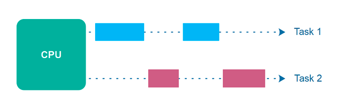
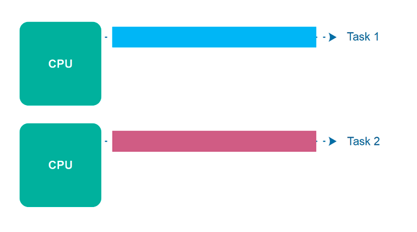
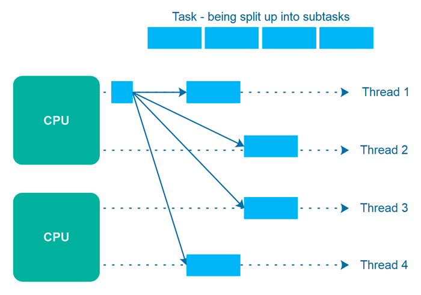

# 병렬성과 동시성

## 동시성

(출처: http://tutorials.jenkov.com/java-concurrency/concurrency-vs-parallelism.html)

### 배경

컴퓨터의 구성요소 중 하나인 CPU(Central Processing Unit)는 말 그대로 컴퓨터 중심부에서 컴퓨터 명령을 처리하는 역할을 합니다. 우리가 컴퓨터를 사용하며 내리는 명령들, 예를 들어 "크롬 브라우저를 실행해줘"를 바로 이 CPU가 처리하게 됩니다.

컴퓨터가 발전하던 초기에는 컴퓨터 하나당 CPU가 하나였습니다. CPU가 하나이니 한 번에 처리할 수 있는 명령도 하나였습니다. 이런 상황에서 만약 단순한 CPU 계산이 아닌 외부 서버와 통신을 하게 되는 I/O 작업들이 많이 있다면 어떻게 될까요?   
예를 들어 어떤 작업이 1분이 걸린다고 하면, 그 중 10초만 CPU를 사용하고 나머지 50초는 API 서버의 응답을 기다리는 I/O Blocking한 상황입니다. 이 50초 동안 CPU는 아무것도 하지 않고 기다리게 됩니다. (이를 CPU가 블락 상태에 있다고 합니다.)

만약 이 50초 동안 가만히 있는 CPU를 그 다음에 수행되어야 할 작업을 미리 만들어서 넣어준다면, 전체적으로 작업 속도가 더 빨라질 것입니다. 즉 CPU가 가만히 있지 않도록 최대한 활용하도록 하는 것이죠.

### 개념
이러한 아이디어는 운영체제에서 구현되어, 하나의 CPU를 최대한 활용하여 여러 작업들을 빠르게 수행합니다. 여전히 CPU는 한번에 하나의 명령어만 처리하지만, CPU가 맡는 프로세스(스레드)가 Block 상태가 되면 빠르게 다음에 처리해야할 프로세스가 CPU를 점유하게 됩니다 (CPU 입장에서는 여러 프로세스를 번갈아 가며 일을 하기 위해선 프로세스의 정보들을 메모리에 저장하고 불러와야 합니다. 이때 CPU가 작업해야할 프로세스를 바꾸는 일을 "컨텍스트 스위칭"이라고 합니다.)

CPU가 쉴 틈 없이 한 번에 주어진 태스크들을 빠르게 처리되다 보니 컴퓨터 사용자는 사실상 모든 프로세스의 명령이 "동시에" 처리된다고 느끼게 됩니다. 사실은 물리적으로 CPU는 1개에, 여러 프로세스를 컨텍스트 스위칭하며 한 번에 하나의 명령을 처리하고 있죠. 이렇게 진행되는 현상을 우리는 `동시성(Concurrency)`이라고 부릅니다.

:::tip
동시성이라는 개념은 물리적으로 CPU 1개의 코어에서만 동작하는 개념은 아닙니다. 제한된 자원에서 여러 작업을 한번에 실행시키려는 논리적인 개념이라고 보시면 됩니다.  
:::

### CPU Bound vs I/O Bound
컴퓨터가 수행하는 하나의 작업은 CPU와 I/O 작업로 이루어집니다. 이 때 컴퓨터 작업을 크게 2가지로 나눠볼 수 있습니다. 하나는 `CPU Bounded Task` 이고, 다른 하나는 `I/O Bounded Task` 입니다.

CPU Bounded Task는 작업을 실행하는데 I/O보다는 CPU를 더 많이 쓰는 작업을 말합니다. 예를 들면 머신 러닝과 같이 연산이 복잡한 로직이 여기에 해당합니다. I/O 작업이 아예 없는 것은 아니지만, 대체로 CPU 사용량이 더 압도적입니다.

I/O Bounded Task는 작업을 실행하는데 CPU보다는 I/O가 더 많은 작업을 말합니다. 예를 들면 크롤링 로직, DB와 연결하여 데이터를 주고받는 로직 등이 여기에 해당합니다. 일반적으로 웹, WAS 서버는 I/O Bounded한 경우가 많습니다. 

## 병렬성

컴퓨터 하드웨어는 점점 발전하여, 이제 컴퓨터 하나당 2개 이상의 CPU를 가질 수 있게 되었습니다. CPU가 2개이므로 이제 우리는 동시에 2개의 명령어를 실행할 수 있습니다. **이렇게 여러 개의 작업을 동시에 진행되는 현상을 `병렬성(Parallelism)`이라고 부릅니다.**

위에서 "동시성"은 실제로는 하나의 명령을 빠르게 수행하지만 처리속도가 매우 빨라 여러 작업이 동시에 진행되는 것처럼 "느껴지게" 해주었다면, 병렬성은 "실제로" 여러 개의 명령어를 동시에 실행하는 것입니다. 물론 운영체제가 여러 CPU를 골고루 쓰도록 매니징해줍니다.

또한 병렬성은 동시성을 품을 수도 있습니다. 여러 개의 CPU를 사용하면서 각각의 CPU에서 여러 태스크(스레드나 프로세스)를 실행시키려고 한다면 동시성을 구현한 것이죠.

## 정리
- 동시성(Concurrency)은 하나의 CPU로 여러 작업을 빠르게 처리하는 것입니다.
    - 여러 작업이 한번에 실행되는 것처럼 보이지만, 실제로는 하나의 CPU에서 처리하고 있는 것입니다.
    - CPU 1코어에 해당하는 물리적인 개념이 아닌, 제한된 자원에서 여러 작업을 한번에 실행시키려는 논리적인 개념입니다.
- 병렬성(Parallelism)은 여러 개의 CPU로 여러 작업을 빠르게 처리하는 것입니다.
    - 여러 작업이 실제로 여러 개의 CPU를 통해 한번에 처리 됩니다.