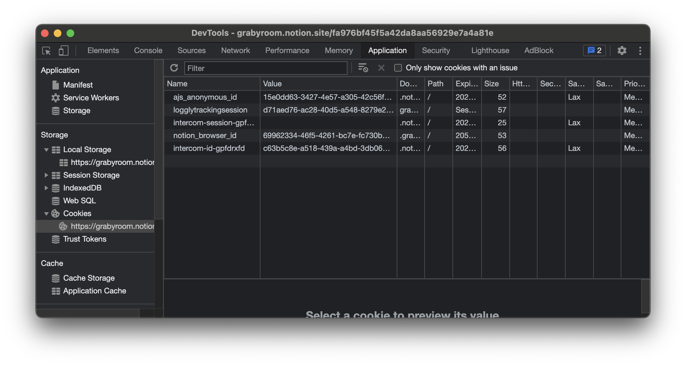

# 쿠키와 세션

...TODO 입력
<br>

## 쿠키와 세션의 등장 배경

HTTP 프로토콜의 특징으로  Connectionless와 Stateless가 있습니다. 한번의 HTTP 통신으로 요청과 응답이 오간 이후에 통신을 끊는다는 것(Connectionless)이고, 이로 인해 통신과 관련된 상태는 남지 않습니다(Stateless).
예를 들어, 사용자가 로그인 요청을 한 뒤 응답을 받았다고 하더라도, 다음 요청에 이렇게 로그인된 정보는 통신 어디에도 남지 않습니다. 따라서 서버 입장에서는 어떤 요청이 있을 때 이 요청이 어떤 사용자의 요청인지 알 수 없습니다.

이렇게 Stateless한 HTTP 통신의 환경의 문제를 세션과 쿠키를 활용해서 해결할 수 있습니다.

<br>

## 쿠키

쿠키는 브라우저가 사용하는 임시 저장소 중 하나입니다. (다른 종류로는 로컬 스토리지, 세션 스토리지 등이 있습니다.) 실제로는 브라우저 사용자 컴퓨터의 로컬 스토리지에 저장됩니다.

쿠키는 Key - Value 형태이며 유효기간을 가진 데이터입니다. 또한 도메인(웹 사이트) 별로 쿠키를 다양하게 둘 수 있습니다.
크롬 브라우저에서 개발자 도구 - Application 탭을 확인해보면 다음처럼 쿠키의 형태를 확인할 수 있습니다.




쿠키는 보통 다음처럼 사용됩니다.

- 서버 세션 관리
- 트래킹 (행동, 패턴 분석)
- 사용자 개인화

특히 인증/인가를 위해 자주 사용되는데, 이에 대한 내용은 아래에서 다룹니다.

<br>

## 세션

세션은 클라이언트와 서버간의 네트워크 연결에 대한 정보를 담고있는 객체입니다. HTTP 통신이 Stateless 하기 때문에, Stateful한 정보를 담는 별도의 객체라고 보면 되겠습니다. 세션은 보통 서버에서 생성하고 관리합니다.

세션도 쿠키와 비슷하게 Key - Value 형태로 둘 수 있습니다. 예를 들면 다음처럼 말이죠.

```json
"session_id": {
    "user_id": "grab",
    "role": "Admin",
    "created_at": "2021-08-11 18:32:01",
    "expire_time": "2021-08-11 19:32:01",
}
```

일반적으로 서버에서는 세션을 관리할 때 ID로 관리하고, 접속 시간에 제한을 두곤 합니다. 클라이언트가 서버와 연결을 시도하면 해당 연결에 대한 정보를 세션 저장소에서 찾습니다. 세션 저장소에 존재 하지않다면 새로운 세션을 만들고 저장합니다. 그리고 클라이언트에게 생성된 세션 정보를 쿠키를 이용해 넘깁니다. 그러면 클라이언트는 해당 정보를 저장하고 있다가, 이후 요청에 세션 정보를 포함하여 요청을 보냅니다. 이렇게 세션은 서버 쪽에서 관리하는 객체로, 클라이언트와 연결에 대한 정보를 담습니다.

세션 역시 인증/인가을 위해 주로 사용됩니다. 이에 대한 내용은 아래에서 다룹니다.

> *** 세션과 쿠키의 차이**
>
> 세션과 쿠키의 가장 큰 차이는, 인증에 대한 정보를 어디에 저장하느냐에 있습니다.
> 쿠키는 이 정보를 클라이언트 쪽에 저장합니다. 즉 인증 절차에 대한 모든 정보가 클라이언트에 저장한 쿠키에 있습니다.
> 세션은 이 정보를 서버 쪽에 저장합니다. 즉 인증 절차에 대한 모든 정보가 서버쪽에서 관리하는 별도의 세션 저장소에 있습니다.

<br>
