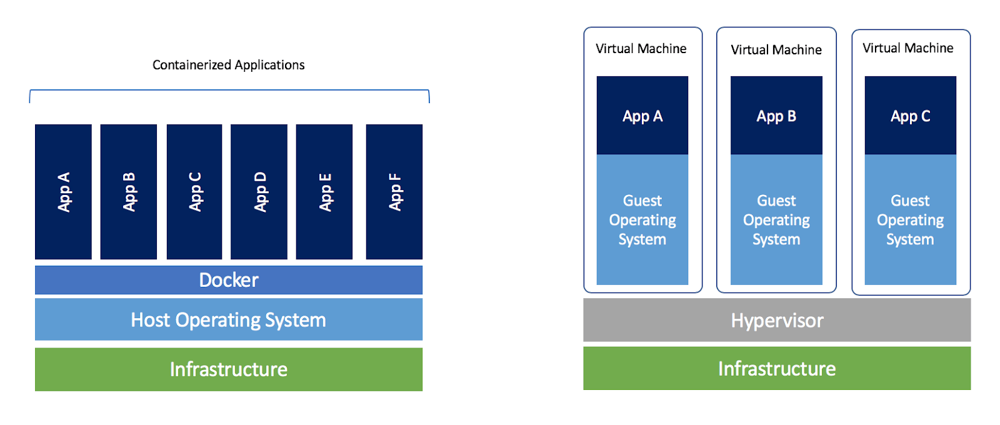

# 가상화 기술과 도커
## 가상화 기술

### 등장 배경

가상화 기술이란 하드웨어 리소스를 추상화하여 소프트웨어화 하는 기술을 말합니다. 예를 들어 우리는 가상화 기술을 통해 "CPU 1코어, Memory는 2Gi , 운영체제는 Ubuntu:16.04" 인 소프트웨어를 만들 수 있습니다. 실제로 우리가 잘 알고 있는 AWS나 GCP, AZURE와 같은 클라우드 서비스들은 가상화 기술이 근본을 이루고 있다고 보면 됩니다. 

가상화 기술의 등장 이전에는 소프트웨어는 하드웨어에 크게 종속되었습니다.
그래서 아래와 같은 문제들이 있었습니다.

- 하나의 서비스를 제공하기 위해서는 하나의 컴퓨터 전체에 서버 프로그램을 띄워서 사용해야만 했습니다. 사용량이 적은 서비스더라도 컴퓨터의 CPU, Memory 등의 리소스를 전부 사용할 수 밖에 없었습니다.
- OS나 하드웨어의 특징에 따라 소프트웨어의 동작에 영향을 끼쳤습니다. 예를 들면 리눅스 컴퓨터에 서버를 운영하는 회사에서 개발자들이 Window 컴퓨터, Mac 컴퓨터를 사용한다면 "내 컴퓨터에서는 됐지만 여기서는 왜 안돼"를 시전할 수 있게 됩니다.  
  
그러나 가상화기술이 나오면서 이런 문제점들은 자연스럽게 해결되었습니다.

- 하드웨어 리소스도 추상화되었기에 서비스에 자원을 자유롭게 할당할 수 있습니다.
- OS에 관계없이 동일한 환경에서 소프트웨어를 구동할 수 있습니다.

실제로 클라우드(AWS, GCP 등)에서 우리가 사용하는 대부분의 서비스는 내부적으로 가상화 기술이 도입되어 있습니다.
우리가 클라우드에서 컴퓨팅 리소스를 빌릴 때 컴퓨터 한 대를 빌리는 게 아닌, 특정 리소스만큼 할당된 가상화 공간을 제공받습니다.

### VM(Virtual Machine)


(출처: https://nickjanetakis.com/blog/comparing-virtual-machines-vs-docker-containers)

VM은 하드웨어를 가상화하는 기술 중 하나입니다. 컴퓨터에 기본적으로 설치한 OS(Host OS) 위에 Hypervisor라는 소프트웨어를 통해 여러 OS(Guest OS)를 띄우고 컴퓨팅 리소스를 제어할 수 있습니다. 그리고 이렇게 만든 각각의 환경에서 애플리케이션을 독립적으로 실행할 수 있습니다.  
예를 들어, VM으로 여러분이 사용하는 Window OS환경에서 별도의 Window, Mac OS, Linux 등의 OS를 동시에 올려두고 각 cpu, memory 사용량 등을 조정할 수 있습니다. 이렇게 하나의 컴퓨터로도 여러 개의 독립된 하드웨어 환경을 격리시켜 실행하는 것이 가능합니다.

그러나 VM은 명확한 단점들이 존재합니다.
1. **용량을 많이 차지합니다.**
   VM은 운영체제를 비롯한 실행 환경에 필요한 파일들을 "이미지" 라는 형태로 저장하고 있습니다. 그런데 이 이미지의 용량 자체가 꽤 큽니다. 따라서 VM으로 여러 가상환경을 운영하면, VM으로만으로도 많은 리소스가 낭비됩니다. (보통 이런걸 무겁다고 표현합니다.)

2. **실행환경의 부가적인 설정들을 완전히 구현하기 어렵습니다.** 
   예를 들어 우리가 실행 환경을 위해 리눅스 이미지를 사용하여 VM 가상환경을 구축한다고 해봅시다. 실제로 서버를 실행하려면 리눅스 이미지 위에 여러 모듈을 설치해야 하는데 설치해야 하는 환경이 그렇게 쉽지는 않았습니다.


<br/>

### 컨테이너(Container)



VM이 너무 무겁다는 불만이 나오는 가운데 `컨테이너`라는 기술이 본격적으로 주목을 받기 시작했습니다.
컨테이너는 원래 리눅스 OS에 내장된 기술로 단일 컴퓨터(머신)에서 프로세스들을 독립적으로 실행할 수 있도록 돕는 기술입니다. 
현재는 VM과 마찬가지로 이미지로 실행환경을 가상화하고 실행시킬 수 있는 도구라고 보시면 됩니다.

컨테이너는 머신의 OS 커널을 직접 공유하기 때문에 VM에 비해 상대적으로 빠르고 가볍습니다. 기존 VM은 하이퍼바이저(Hypervisor)라는 소프트웨어 위에 OS를 추가로 실행해야 하기에 무거운 반면, 컨테이너 기술은 OS 커널과 컨테이너를 연결해주는 컨테이너 엔진(도커와 같은)만 있으면 되기 때문이죠.

:::tip
컨테이너 기술이 VM보다 모든 면에서 뛰어나다는 건 아닙니다. 컨테이너는 격리된 환경처럼 보이지만 실제로는 같은 OS를 바라보는 가상으로 격리된 프로세스입니다. 
따라서 OS 커널에 장애가 발생하면 같이 영향을 받을 수밖에 없으며 보안적으로 취약한 문제가 있습니다.
:::

## 도커(Docker)
컨테이너를 실행하기 위해선 컨테이너 엔진을 필요로 합니다. 현재 가장 유명한 컨테이너 엔진은 바로 `도커(Docker)`입니다. 대부분의 리눅스, 맥, 윈도우 OS 유저들은 도커를 표준처럼 사용하고 있습니다.

도커에는 크게 `컨테이너`와 `이미지`라는 개념이 있습니다. 컨테이너는 논리적으로 격리된 프로세스를 의미하며 이미지는 컨테이너를 실행하기 위한 정보(소스 코드, 라이브러리 등)를 담고 있는 것입니다.

VM에서는 "이미지"를 만드는 것이 시간이 오래 걸리고 용량도 큰 작업이었는데, Docker에서는 비교적 빠르고 용량도 가볍습니다. Docker에서는 이 이미지를 누구나 쉽고 빠르게 만들 수 있습니다.

### 실습
도커를 사용하는 예시를 간단하게 살펴보겠습니다.
다음처럼 파이썬 코드가 실행될 컨테이너의 정보를 담고 있는 이미지를 만들 수 있습니다. (아래 코드는 `Dockerfile` 이라는 파일에 담깁니다.)

```Dockerfile
# 파이썬 코드를 실행하는 이미지를 만듭니다.
# 리눅스 우분투 이미지를 기반으로 만듭니다. (기반이 되는 이미지를 베이스 이미지라고 합니다.)
FROM ubuntu:18.04

# 리눅스 우분투 환경에 파이썬을 설치합니다.
RUN apt-get update -y
RUN apt-get install -y python-pip python-dev build-essential

# 우리가 작성한 파이썬 코드를 설치하고 실행합니다.
COPY .. /app
WORKDIR /app
RUN pip install -r requirements.txt
ENTRYPOINT ["python"]
CMD ["app.py"]
```

위에서는 베이스 이미지로 `ubuntu:18.04` 를 사용했지만, 다음처럼 파이썬이 이미 설치되어 있는 이미지를 베이스 이미지를 사용할 수도 있습니다.

```Dockerfile
# 파이썬 코드를 실행하는 이미지를 만듭니다.
# 파이썬 3.8 이미지를 베이스 이미지로 사용합니다.
FROM python:3.8

# 우리가 작성한 파이썬 코드를 설치하고 실행합니다.
COPY . /app
WORKDIR /app
RUN pip install -r requirements.txt
ENTRYPOINT ["python"]
CMD ["app.py"]
```

이후 다음처럼 도커 명령어로 위 `Dockerfile` 파일을 가지고 이미지를 만듭니다. (이를 보통 빌드한다고 합니다)

```bash
$ docker build . -t my-app
```

이렇게 만든 이미지는 다음처럼 도커 명령어로 확인할 수 있습니다.

```bash
$ docker images
REPOSITORY                   TAG                        IMAGE ID       CREATED        SIZE
my-app                       latest                     828b1334ba8f   24 hours ago   305MB
```

이렇게 만든 이미지는 다음처럼 실행 가능합니다. 명령어를 치면 컨테이너가 도커 엔진 위에서 실행됩니다.

```bash
$ docker run my-app
```

Dockerhub라고 하는 이미지 저장소에 이렇게 사용할 수 있는 이미지가 매우 많습니다. 이렇게 공개된 이미지로 나만의 이미지를 만들 수 있고, 자신이 만든 이미지를 이미저 저장소에 공개할 수도 있습니다.


(Dockerhub 사이트: https://hub.docker.com/)

예를 들어 Dockerhub에 공개된 mysql 5.8 이미지를 사용하고 싶으면 다음처럼 docker 명령어를 입력하면 됩니다.

```bash
$ docker pull mysql:5.8
$ docker run mysql:5.8
```

이를 통해 컴퓨터에 손쉽게 mysql을 실행시킬 수 있습니다.

## 정리
- 가상화 기술의 큰 축은 VM과 컨테이너 기술입니다.
    - VM은 이미지마다 전용 운영체제가 있기에 안정적인 프로세스 격리가 가능하지만, 이미지 용량이 크고 속도가 느린 편입니다.
    - 컨테이너 기술은 VM과 다르게 Guest OS를 가지지 않도록 기술적으로 구현되었습니다. 그래서 상대적으로 가볍고 빠릅니다.
- 컨테이너 기술을 쉽게 실행하고 관리할 수 있도록 돕는 오픈소스 플랫폼으로 도커가 있습니다.
    - `Dockerfile` 내에 실행하기 위한 모든 설정이 기록되어 있기 때문에, Docker 문법을 아는 사람이라면 쉽게 실행환경을 이해할 수 있고 재현할 수 있습니다.
    - `Dockerfile` 에 작성된 설정 말고는 별다른 의존성이 없습니다. 따라서 도커가 설치된 어느 컴퓨터에서든 도커 이미지를 실행시키면 동일한 실행환경에서 소프트웨어를 실행시킬 수 있습니다.
