# 우리 회사는 어떻게 웹 서비스를 운영할까?

이번 시간에는 유저의 요청이 웹 서비스에 어떻게 도달하는지 그 흐름을 살펴보며, IT 서비스의 네트워크 통신 흐름을 파악해 봅시다.

> 클라우드(AWS) 위에 웹 애플리케이션을 배포한 상태를 기준으로 설명합니다. 쉬운 이해를 돕기 위해 기본적인 구성 요소 위주로만 다룹니다. 
>
> AWS가 아닌 다른 클라우드나 인프라도 대부분 이와 비슷하기 때문에, 전체적인 그림과 흐름을 잘 이해한다면, 다른 클라우드 인프라도 쉽게 이해할 수 있을 겁니다.

 

## 전체적인 그림

웹 서비스가 제공되는 전체적인 그림은 아래와 같습니다.

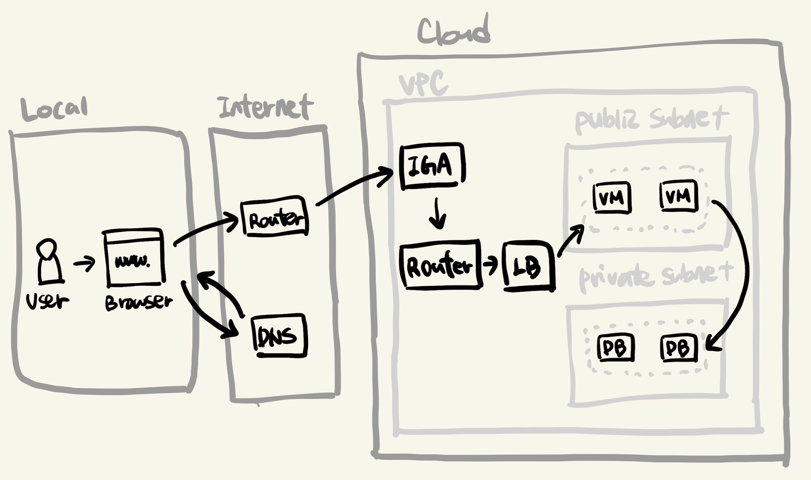

간략하게 설명하면, 다음 과정이 일어납니다.

- 유저는 **로컬**에서 웹 브라우저를 통해 웹 서비스에 접속 요청을 보냅니다.
- **인터넷** 망에 있는 라우터를 통해 요청 패킷이 서버로 전달됩니다.
- **클라우드** 내에 있는 서버가 이를 수신하여 응답합니다.

각 과정에 대해서 좀 더 자세히 알아봅시다.

 

## Local

### Browser

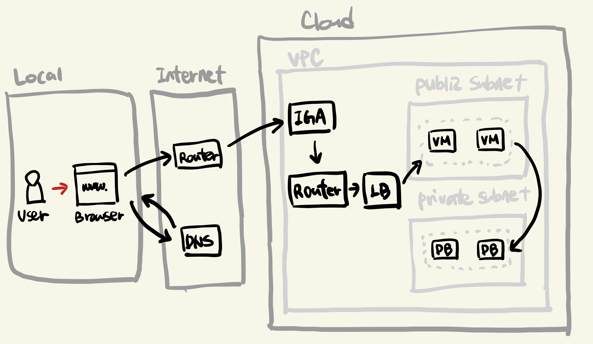

- 유저가 본인의 컴퓨터에서 웹 브라우저에 접속하여 특정 도메인으로 요청을 보냅니다.
    - 웹 서비스 대부분의 요청/응답은 **HTTP 형태**로 이루어집니다.
    - ex. `www.naver.com` 으로 `GET` 요청을 보냅니다.
    - `POST` 요청에 `form` 데이터나 `json` 요청을 보낼 수도 있습니다.
- 유저의 요청은 **네트워크 통신에 용이한 데이터**로 만들어집니다. 
    - OSI 7계층을 떠올려봅시다.
    - 유저가 입력한 데이터는 7계층 데이터에 해당이 되고, 이 데이터가 각 6, 4, 5 ... 계층을 거쳐 1계층 데이터로 만들어진다는 것을 생각해볼 수 있습니다.

 

## Internet

### DNS

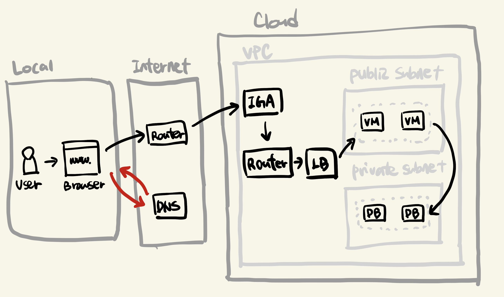

- **DNS** 서버에 요청해 현재 도메인의 **IP 주소**를 알아냅니다.
    - 최초 DNS 서버는 각 통신 벤더사(KT, SKT)의 DNS서버를 사용합니다.
    - DNS서버는 해당하는 도메인 레코드가 자신에게 있는지 찾고, 없으면 연결된 다른 네임서버에게 요청합니다.
    - 큰 회사들(네이버나 AWS같은..)은 대부분 네임 서버를 별도로 가지고 있는데, 이런 서버들에게 최종적으로 요청이 가게 됩니다.

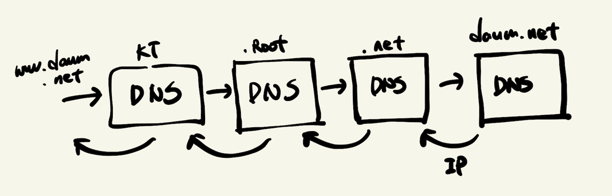

### Router

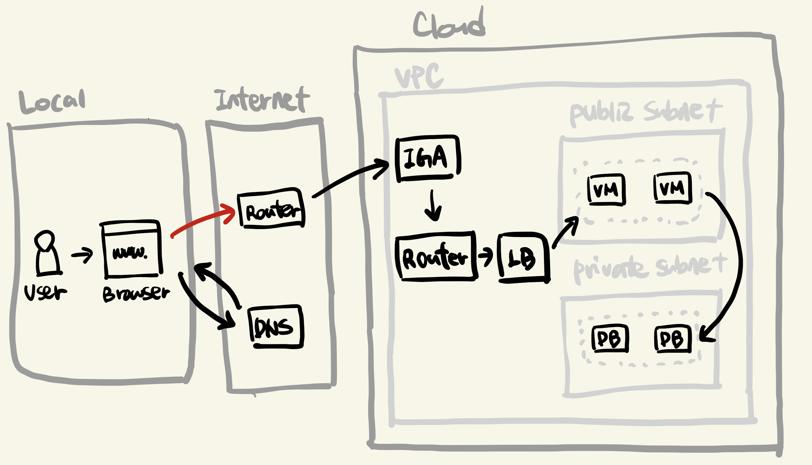

- IP를 가지고 이제 네트워크 망에 있는 **라우터**에 요청이 흐릅니다.
    - 인터넷에는 아래처럼 수많은 라우터가 있고, 이 라우터들을 통해 요청 데이터가 전달됩니다.
    - 라우터들은 각자 가지고 있는 라우팅 테이블을 통해 어떤 라우터로 요청 데이터를 전달할지 결정합니다.

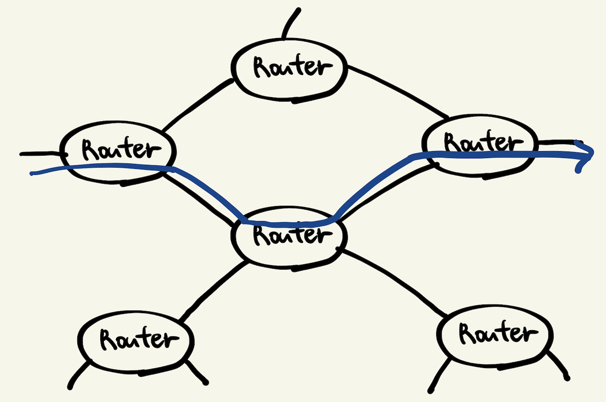

 

## Cloud

### IGW

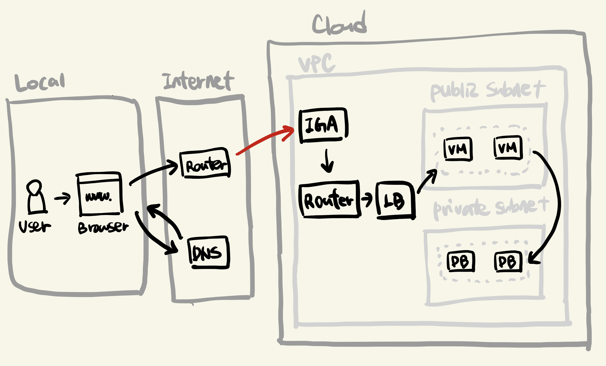

- 네트워크의 라우터들을 거쳐 이제 클라우드 영역에 도달합니다.
- 클라우드 영역에는 **VPC(Virtual Private Cloud)** 라고 불리는 가상의 네트워크 영역이 존재합니다.
    - VPC는 다시 **서브넷(Subnet)** 이라고 하는 좀 더 작은 범위의 네트워크 영역을 가지고 있습니다.
    - 서브넷은 보통 외부에 공개할 **퍼블릭 서브넷**과 **프라이빗 서브넷**으로 나뉩니다.
    - 이 서브넷에 클라우드 리소스(VM, DB 등)을 두게 됩니다.
- VPC에는 외부 인터넷 공간과 연결을 담당하는 **igw(Internet Gateway)** 가 있습니다.
    - 인터넷을 통해 클라우드에 들어온 데이터는 먼저 이 igw를 거치게 됩니다. 

### Router & LB

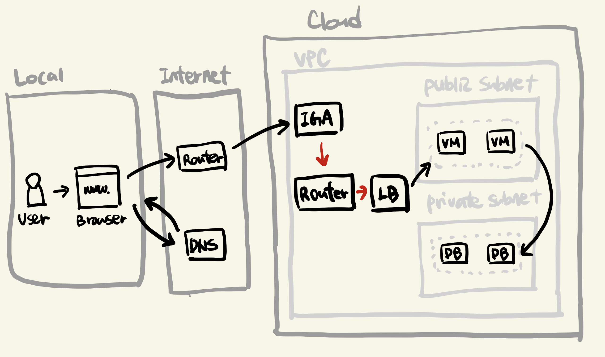

- igw를 거친 데이터는 이제 클라우드 내 **라우터**에 도달합니다. 
    - 라우터에는 해당 IP 주소를 VPC 내부 리소스 중 어디로 보낼지에 대한 **라우팅 테이블**을 가지고 있습니다.
    - 물론 이렇게 클라우드 리소스를 외부에 퍼블릭하게 제공하려면, 클라우드 리소스 생성 후 Public IP를 부여해야 합니다. 현재 우리의 리소스는 이렇게 퍼블릭하게 열려있다고 가정합니다.
- 해당 IP는 **LB(Load Balancer)** 를 가리키게 되고, 요청은 LB로 향합니다.
    - LB는 말 그대로 부하 분산기입니다. 같은 IP로 들어오는 요청을 여러 개의 리소스(위에서는 VM)으로 요청을 분산시킵니다.
    - LB가 있으면 VM을 언제든 여러 개로 둘 수 있습니다. 즉 서버 요청이 많아질 때 언제든 VM을 수평적으로 늘릴 수 있다는 것입니다. (이를 오토스케일링이라고 합니다.)
    - LB는 서비스를 위한 필수요소는 아니지만, 트래픽 분산을 필요로 하는 대부분의 서비스가 가지고 있다고 보면 됩니다.
- LB를 거쳐 이제 요청은 실제로 우리가 코딩한 서버가 떠있는 **VM**에 다다릅니다.

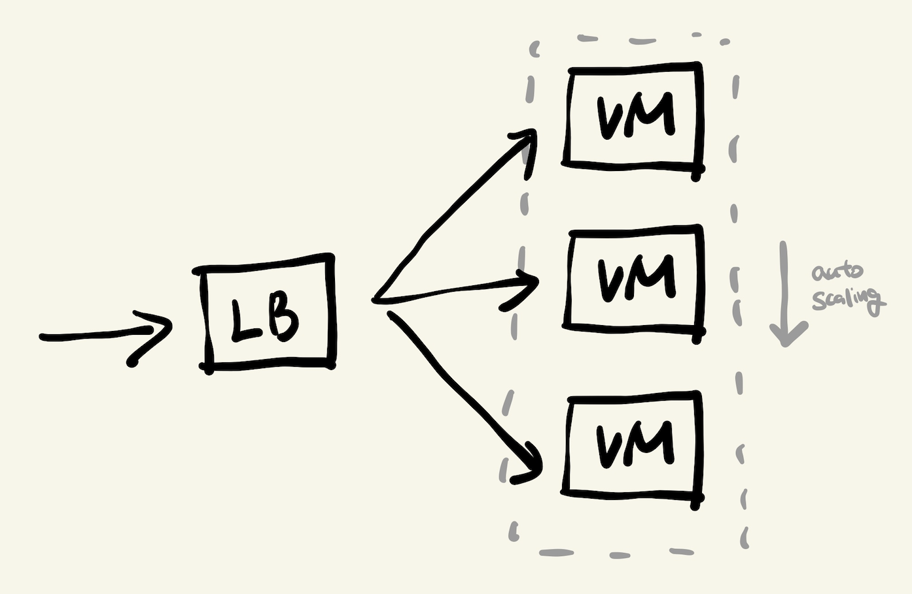

### VM (Virutal Machine)

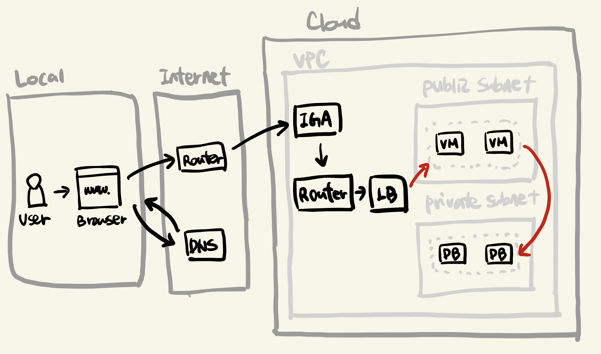

- LB를 거쳐 사용자 요청은 **퍼블릭 서브넷**에 있는 **VM 그룹 중 하나**에 들어가게 됩니다.
- 서버에서 데이터 저장, 복원 등을 위해 DB를 사용할텐데, 이런 DB는 보통 VPC 외부에서 접근이 불가능한 **프라이빗 서브넷**에 위치하게 됩니다.

> 'VM 1개 = 물리적인 컴퓨터 1대'가 아닙니다. VM은 말 그대로 가상 컴퓨팅 노드이며, 실제로는 어떻게 구성되었는지는 클라우드 벤더사(AWS, GCP)마다 다를 수 있습니다. 중요한 것은 이게 실제로 컴퓨터 1대이느냐가 아니라, VM을 사용하는 입장에서는 컴퓨터 1대를 쓰는 것과 동일한 사용성을 느낀다는 것입니다.
>
> VM은 AWS의 EC2 와 같은 것이 대표적인 서비스며, 쿠버네티스의 경우 노드 하나를 이야기합니다.

VM 안에서 작동하는 요청 흐름을 좀 더 살펴보면 다음과 같습니다.

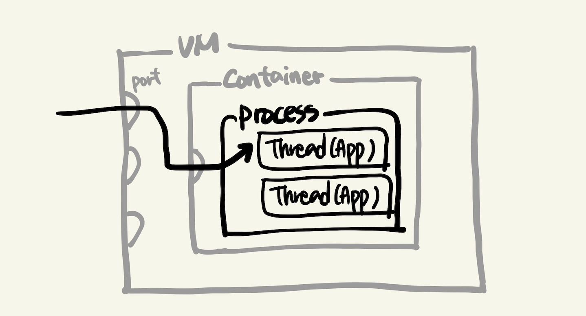

- 요청은 VM의 **특정 포트**로 들어가 VM내 서버를 실행하고 있는 **프로세스**에 도달합니다.
    - 컨테이너 환경으로 서버를 실행한다면, 보통은 VM을 빌려서 컨테이너를 별도로 띄우기 보단, 한 단계 추상화되어 있는 컨테이너 서비스(ex. ecs)나 쿠버네티스 서비스(ex. eks)를 사용하곤 합니다. 
    - 컨테이너 환경이 아니라면, container 없이 바로 process로 접근합니다 (ec2같은 Virtual Server를 사용)
  - 서버 프로세스에는 보통 여러 개의 **스레드**가 동작하고 있으며, 각 스레드는 프로그램 로직(함수)을 실행합니다.
    - 동시에 여러 요청을 처리하기 위해 멀티 스레드를 예로 들었습니다.
    - 실제로 어떤 서버 프레임워크를 쓰냐에 따라 멀티 프로세스로 동작할 수도 있습니다. 
- 요청에 대한 응답은 다시 스레드로부터 나와 지금까지 흘러온 순서 반대로 진행되어 사용자에게 전달됩니다.

 

