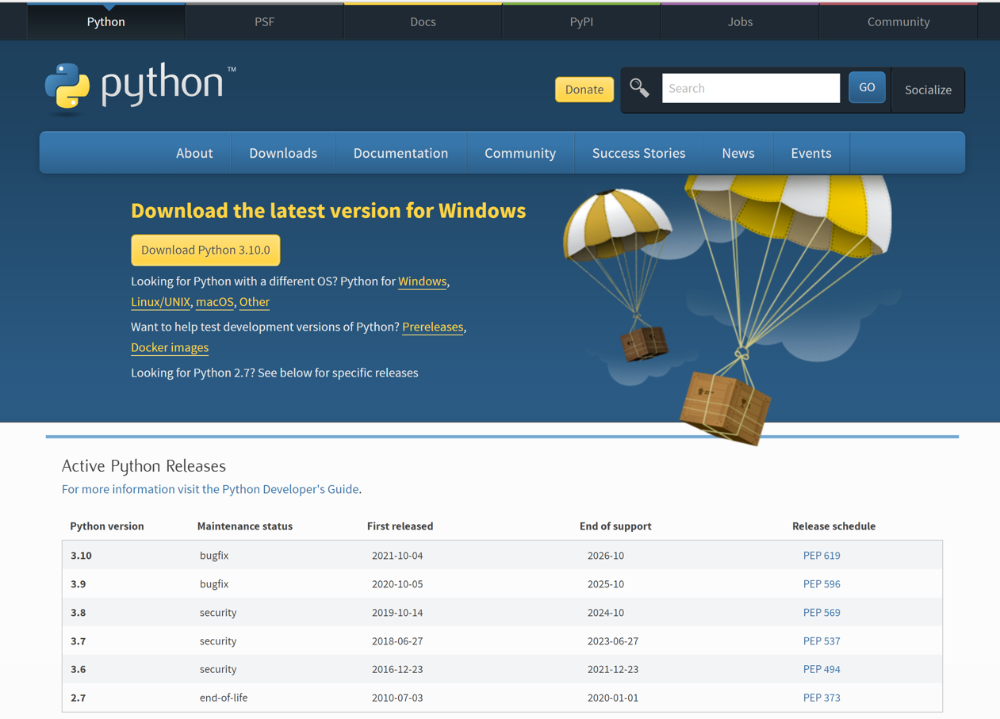
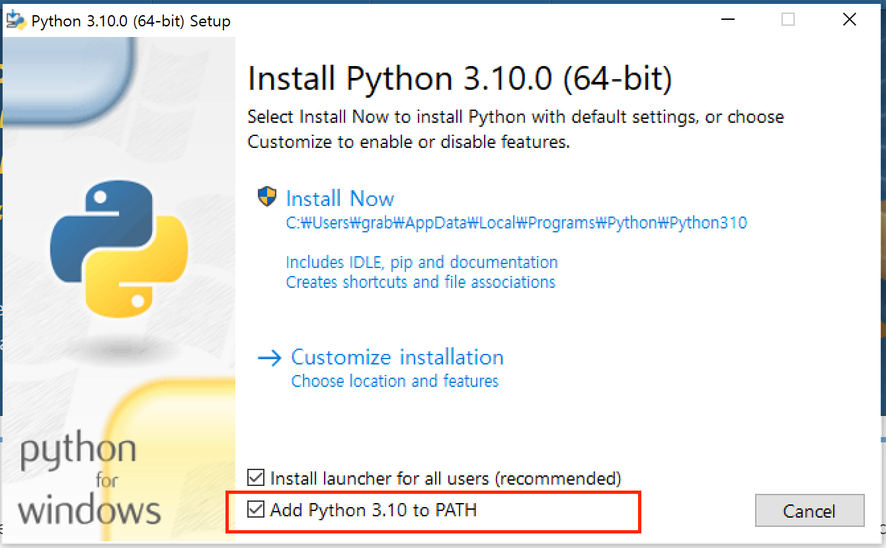
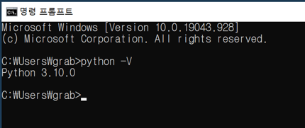
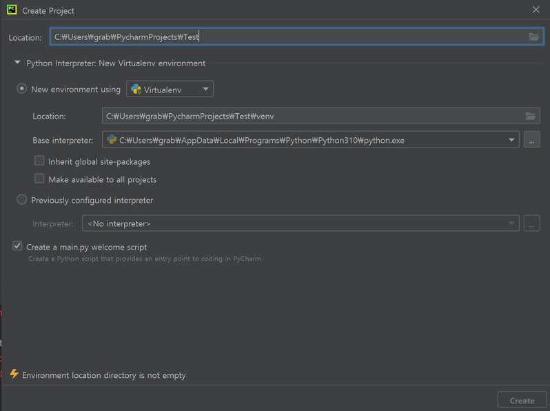
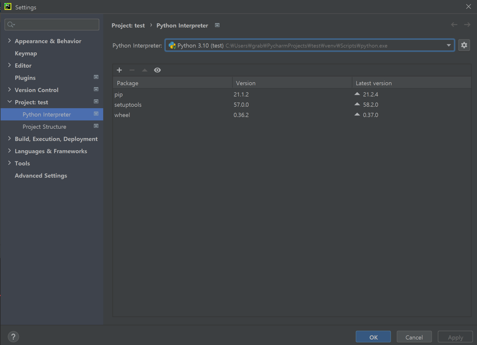

# 사전 준비
이후 강의에서 진행하는 실습은 `Python` 언어를 사용하며 `Pycharm` 에디터를 사용하게 됩니다.

## 파이썬 설치
**Python 3.10** 버전 대로 실습을 진행합니다. 

:::tip
Python 버전을 다양하게 사용할 수 있도록 돕는 `pyenv`와  
프로젝트 별로 의존성을 관리할 수 있도록 돕는 `virtualenv`나 `anaconda`가 많이 사용됩니다.

이번 강좌에서는 위 툴을 사용하지 않습니다.  
:::

### Window
[파이썬 공식 홈페이지](https://www.python.org/downloads/) 에서 3.10 버전을 설치해주시면 됩니다.

(파이썬 최신 버전이 올라갔다면 아래 쪽에 specific version을 선택하여 설치할 수도 있으니 참고해주세요)


파이썬을 설치할 때 환경 변수(PATH)를 추가해주는 옵션을 선택합니다.


python이 제대로 설치되었는지 확인합니다.  


### Mac
mac의 경우 python 2 버전이 기본적으로 설치되어 있지만 3.10 버전으로 추가해줍니다.

cli 환경에서 패키징 매니저 brew로 설치해줍니다 (혹은 웹에서 직접 다운받으셔도 됩니다)

```bash
$ brew install python@3.10
```

기본 python 명령어의 버전을 바꾸기 위해 심볼릭 링크를 업데이트 해줍니다.  
[참고 링크](https://dev.to/malwarebo/how-to-set-python3-as-a-default-python-version-on-mac-4jjf) 

```bash
ln -s -f /usr/local/bin/python3.10 /usr/local/bin/python
```

## Pycharm 설치
[파이참 공식 홈페이지](https://www.jetbrains.com/pycharm/) 에서 Community Edition 을 설치해줍니다.

설치를 완료한 후 프로젝트를 생성했다면, 프로젝트 범위의 Virtualenv 가상환경이 생성됩니다. 해당 가상환경(venv)에서 외부 의존성이 설치됩니다(pip install)



일반적으로 파이썬 스크립트를 실행하기 위해선 Interpreter가 필요합니다. 위에서 프로젝트 초기화를 할 때 제대로 Interpreter 설정이 되었는지 다시 확인해줍니다.
만약 설정이 안됐다면 `우측 톱니바퀴 -> Add -> New environment` 를 추가해주면 됩니다.  

`Settings -> Project -> Python Interpreter`



실습 중 cli 명령어는 pycharm의 `Terminal`에서 진행합니다.


