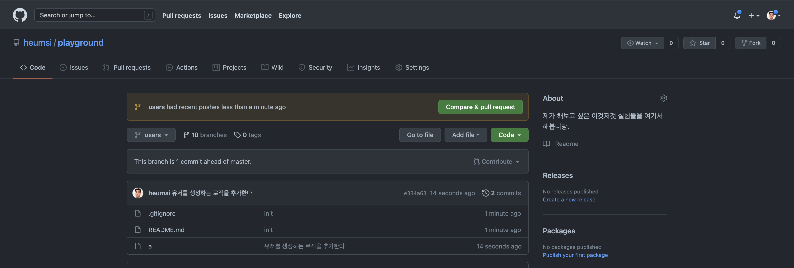
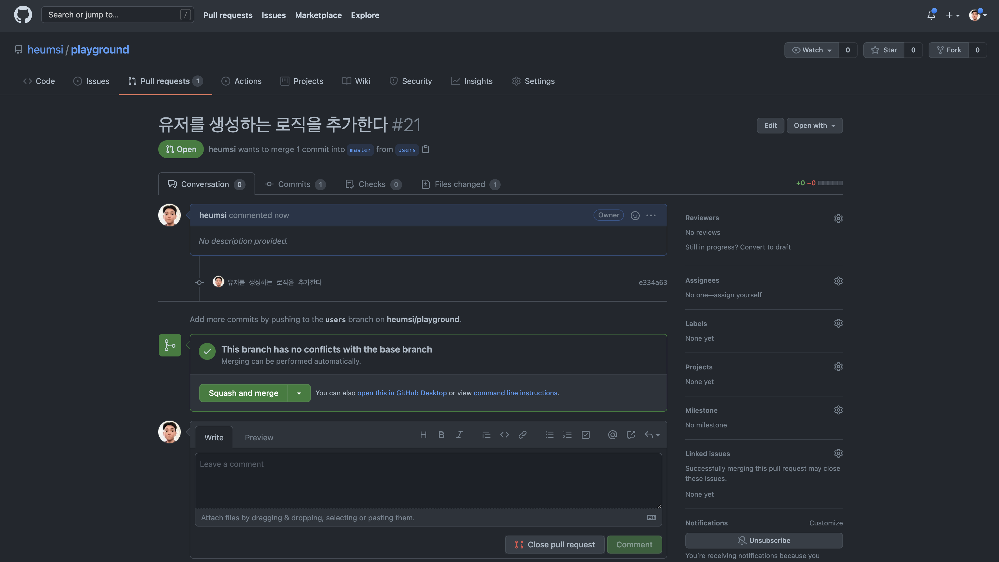
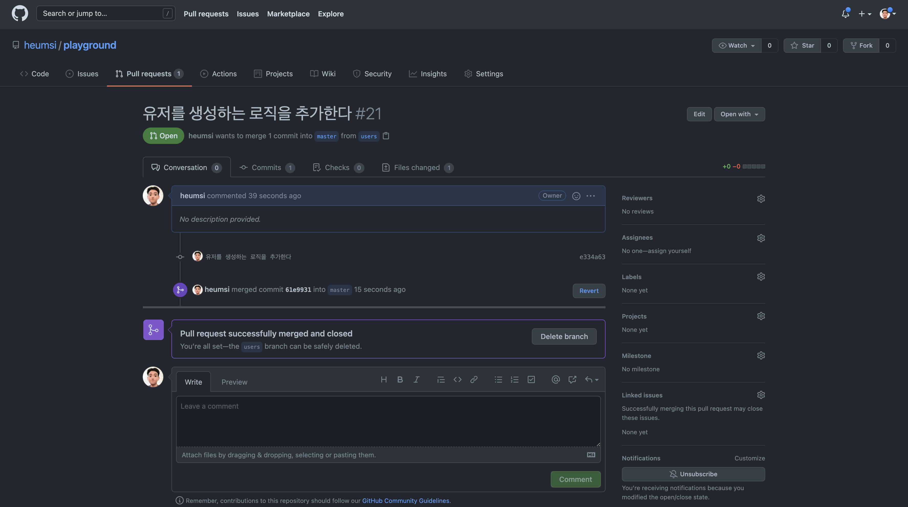

# 브랜치로 협업하기

## 브랜치란?


(출처: https://www.nobledesktop.com/learn/git/git-branches)

하나의 개발 프로젝트에 참여하는 개발자 A와 개발자 B가 동시에 작업해야 하는 경우는 어떻게 해야할까요? 위의 예시처럼 개발자 A가 먼저 작업을 완료한 뒤 개발자 B가 이어서 순차적으로 작업할만큼 현실에서는 넉넉한 시간을 주지 않습니다. 개발 기간동안 개발자 A와 B가 담당할 기능을 미리 정하고 동시에 작업하는 경우가 대부분입니다.

Git에서 브랜치는 여러 작업을 각각의 독립된 공간에서 진행할 수 있도록 하는 기능입니다. 하나의 브랜치는 독립된 workspace, index, local repository, remote repository 공간을 가집니다. 위에서 우리는 따로 언급하지는 않았지만 사실 `master` 라는 기본 브랜치 위에서 작업했습니다. 우리는 브랜치 위에서 새로운 브랜치를 생성해 독립된 작업 공간을 만들 수 있습니다.

이처럼, 브랜치를 이용하면 하나의 프로젝트에서 여러 사람이 동시에 본인의 작업을 진행 할 수 있습니다.


## 브랜치를 이용한 작업 흐름

이제 브랜치를 이용한 작업 흐름은 보통 다음과 같습니다.

1. 각 개발자들은 메인 브랜치에서 각자 자신이 작업할 새로운 브랜치를 만듭니다.

2. 각 개발자들은 본인이 만든 브랜치 위에서 작업합니다.

3. 깃 호스팅 서버(GitHub 등)를 쓰지 않는 경우 아래 흐름을 따릅니다.

    - 작업 완료 후 작업한 브랜치를 메인 브랜치에 머지합니다.

    - local repository의 메인 브랜치가 업데이트 되었으므로, remote repository 에도 푸시하여 최신 내역을 공유합니다.

4. 깃 호스팅 서버를 쓰는 경우 아래 흐름을 따릅니다.

    	- 작업 완료 후 remote repository의 자신이 작업한 브랜치를 푸시합니다.

    - remote repository에서 메인 브랜치로 Pull Request를 합니다.
    - 협업하는 다른 개발자에게 리뷰를 받습니다.
    - 리뷰 및 합의가 된 이후에는 메인 브랜치에 머지합니다.

예시를 통해 좀 더 구체적으로 살펴봅시다.

쇼핑몰 웹사이트 서버 개발 프로젝트에 개발자 A와 B가 참여했다고 합시다. 회의를 통해 개발자 A는 유저 관련 기능을, 개발자 B는 결제 관련 기능을 개발하기로 했습니다. 또한 Git으로 코드와 버전 관리를 관리하고, remote repository로 GitHub를 사용하고 각자 작업 완료 후에는 PR을 날려 리뷰하기로 정했습니다.

우리는 개발자 A라고 합시다. 먼저 다음처럼 `git switch -c` 명령어로 우리가 사용할 브랜치를 만듭니다. 우리는 유저 관련 기능을 개발하기로 했으므로, 브랜치 이름도 `users` 라고 짓겠습니다.

```bash
# 현재 브랜치(master)에서 users 라는 새로운 브랜치를 만듭니다.
$ git switch -c users

# 위 명령어는 사실 git switch -c users master와 동일합니다.
# git switch -c {새로운 브랜치 이름} {기준 브랜치} 이 명령어 포맷입니다.
# 뒤에 {기준 브랜치}는 생략 가능하며, 생략할 시 현재 브랜치를 기준으로 새로운 브랜치가 만들어집니다.
```

이 명령어의 실행 결과로 우리는 기존의 메인 브랜치인 `master` 브랜치에서 `users` 로 바꾸었습니다. 이제 `users` 브랜치는 `master` 브랜치와는 독립적인 4개의 공간을 가지게 됩니다.

이제 우리는 `users` 브랜치 위에서 일련의 작업을 완료했다고 합시다. 이 과정 중에 우리는 다음처럼 `git add` 와 `git commit` 을 반복했을 것입니다.

```bash
$ git add {파일} 혹은 {디렉토리}
$ git commit -m "작업 내역에 대한 내용..."
```

이 다음 작업은 깃 호스팅 서버를 사용하느냐 안하느냐에 따라 조금 다르게 나뉩니다.


### 깃 호스팅 서버(GitHub 등)를 쓰지 않는 경우

이제 `users` 브랜치에서 작업한 내역을 이제 메인 브랜치에 합쳐봅시다.

```bash
# 합치기 위해 먼저 main 브랜치로 이동합니다.
$ git switch main

# usrs 브랜치를 현재 브랜치(master)에 합칩니다.
$ git merge users
```

업데이트된 `master` 브랜치를 remote repository에도 푸시로 반영합니다.

```bash
$ git push origin master
```


### 깃 호스팅(GitHub) 서버를 쓰는 경우

이번에는 깃 호스팅 서버로 GitHub를 사용하고 있는 경우입니다.

다음처럼 작업 내역을 remote repository에 보냅니다. 이 때 다음처럼 자신이 만든 브랜치 이름과 동일한 브랜치에 `git push` 해야 합니다.

```bash
# git push origin {자신의 작업한 브랜치 이름}
$ git push origin users
```

이제 GitHub에 미리 만들어둔 프로젝트(remote repository)의 `users` 브랜치가 생기고, 다음처럼 우리가 `users` 브랜치에서 작업한 내용이 올라가게 됩니다.



GitHub에서 `master` 브랜치로의 PR(Pull Request) 생성함으로써 개발자 B에게 나의 작업 내역을 공유하고 메인 브랜치(`master` 브랜치)로의 머지 요청을 하게 됩니다.



리뷰를 거쳐 PR이 승인이되고, 우리의 작업 내역이 메인 브랜치에 머지되고나면 우리가 맡은 작업은 끝이 납니다. 작업이 완료된 브랜치는 깔끔한 정리를 위해 보통 삭제합니다.



> 회사에서는 보통 GitHub나 BitBucket, GitLab과 같은 깃 호스팅 서버를 사용하는게 일반적입니다.

<br>

## 정리
- 브랜치를 통해 하나의 프로젝트에서 독립된 작업 공간을 가질 수 있습니다.
    - 각 브랜치 별로 위의 4가지 공간을 갖게 됩니다.
    - 협업할 때는 보통 각자 작업할 브랜치를 만들고 그 위에서 작업합니다.
    - remote repository에서 각자 브랜치 작업을 리뷰 받은 뒤, 메인 브랜치로 머지합니다.

<br>

## 더 공부하면 좋을 것들

- [FlyingSquirrel 블로그 - git rebase 하는 방법](https://flyingsquirrel.medium.com/git-rebase-%ED%95%98%EB%8A%94-%EB%B0%A9%EB%B2%95-ce6816fa859d)
- [Evan moon 블로그 - Git 뉴비를 위한 기초 사용법 - 시작하기](https://evan-moon.github.io/2019/07/25/git-tutorial/)
- [geekk 블로그 - GitHub Tips](https://octob.medium.com/github-tips-74dc0673e1b1)
