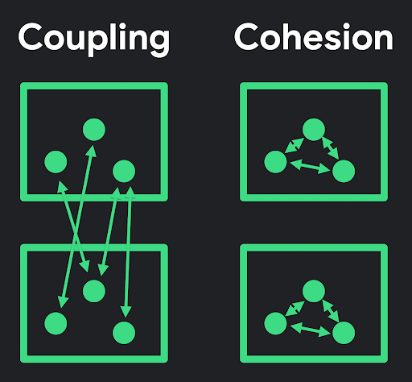

# 의존성 응집도 결합도

## 의존성
객체 A 입장에서 객체 B의 존재를 알고 있을 때, "객체 A는 객체 B에 의존성이 있다" 라고 합니다.  
의존성은 크게 2가지로 나눠볼 수 있습니다.

### 정적 의존성
코드 레벨에서 객체 A 내에서 객체 B에 접근하는 경우입니다. 다음 예시를 보겠습니다.

```python
from abc import ABC, abstractmethod

class Job(ABC):
    @abstractmethod
    def do(self) -> None:
        pass

    
class DataEngineer(Job):
     def do(self) -> None:
        print(f"데이터 엔지니어링 관련된 일을 합니다.")
        

class User:
    def __init__(self, name: str, job: DataEngineer) -> None:
        self.name = name
        self.job = job
        
    def work(self) -> None:
        self.job.do()
```

위 코드에서 `User` 의 생성자(`__init__(self)` 메서드) 에서  `DataEngineer` 객체를 파라미터로 받고 있습니다. 즉 `User` 가 `DataEngineer` 이라고 하는 객체의 존재를 알고 있는 것입니다. 이처럼 코드 레벨에서 직접적으로 두 객체의 의존 관계를 파악할 수 있을 때, 정적 의존성이 있다고 합니다. 컴파일 의존성이라고도 합니다.

위의 경우 `User` 객체가 `DataEngineer` 객체에 정적 의존성이 있습니다. 

### 동적 의존성

코드 레벨에서 의존성이 드러나지는 않지만, 실제 실행 과정에서 두 객체 간 의존 관계가 있을 때 동적 의존성 관계에 있다고 합니다. 다음 예시를 보겠습니다.

```python
from abc import ABC

class Job(ABC):
    def do(self) -> None:
        print(f"{self.work_type} 관련된 일을 합니다.")
    
    
class DataEnginner(Job):
    work_type = "데이터 엔지니어링"
    
    
class ProjectManager(Job):
    work_type = "프로젝트 매니징"
    
    
class User:
    def __init__(self, name: str, job: Job) -> None:
        self.name = name
        self.job = job
        
    def work(self) -> None:
        self.job.do()
```

위 코드에서 `User` 객체는 `Job` 객체(인터페이스)에 정적인 의존성이 있습니다. `DataEnginner` , `ProjectManager` 에는 의존성이 없습니다.

하지만 다음처럼 실제 코드가 실행될 때 `User` 에 `DataEnginner` 나  `ProjectManager` 에 의존성이 있도록 만들어줄 수 있습니다.

```python
>>> user_1 = User(name="grab", job=DataEnginner())  # 여기서 동적으로 의존성을 만들어줍니다.
>>> user_1.work()

"데이터 엔지니어링 관련된 일을 합니다."
```

만약 `ProjectManager` 로 의존성을 주고 싶으면 다음처럼 하면 됩니다.

```python
>>> user_2 = User(name="grab", job=ProjectManager())  # 여기서 동적으로 의존성을 만들어줍니다.
>>> user_2.work()

"프로젝트 매니징 관련된 일을 합니다."
```

동적 의존성은 이렇게 코드 레벨이 아닌, 실제 실행 환경에서 동적으로 의존 관계를 형성할 수 있는 의존성을 말합니다. 보통 위와 같이 추상 클래스 혹은 인터페이스를 파라미터 타입으로 두고 (`def __init__(self, name: str, job: Job)` 부분 ) 실제로 위 클래스를 생성할 때 구체적인 클래스를 인자로 넘겨주는 방식(`User(name="grab", job=DataEnginner())`)으로 동적 의존성을 구현하곤 합니다.

:::tip
위와 같이 정적 의존성 대상을 고수준 코드로, 동적 의존성 대상을 저수준 코드로 넣어주게 되면 더 유연한 설계가 가능해집니다.  
:::


## 결합도(Coupling)와 응집도(Cohesion)



객체지향에서 좋은 설계란 무엇일까요? 흔히들 좋은 설계란 "낮은 결합도와 높은 응집도를 가진 설계"라고 말하곤 합니다. 그렇다면 결합도와 응집도란 무엇일까요?

### 응집도
객체의 책임에 맞게 속성과 메서드가 유기적으로 결합되어 있는 정도를 `응집도`라고 합니다.

객체는 하나의 책임(SRP)을 수행하도록 잘 설계되어야 합니다. 그래야 중구난방으로 객체가 존재하지도 않고 하나의 객체가 큰 책임을 가지지도 않습니다.
이때 응집도를 높게 코드를 작성한다면, 관련성이 높은 속성과 메서드가 모여있기에 흐름을 읽기 편해집니다. 또한 불필요한 속성과 메서드를 줄일 수 있어 더 탄탄한 코드를 작성할 수 있습니다.  

```python
#응집도가 낮은 경우입니다.
class LowCohesion:
    def __init__(self):
        self.a = ...
        self.b = ...
        self.c = ...
    
    def process_a(self):
        print(self.a)
    
    def process_b(self):
        print(self.b)
    
    def process_c(self):
        print(self.c)       

#응집도가 높은 경우입니다.
class HighCohesion:
    def __init__(self):
        self.abc = ...
    
    def process_a(self):
        self.abc.process_a()
    
    def process_b(self):
        self.abc.process_b()
    
    def process_c(self):
        self.abc.process_c()
 ```


### 결합도
`결합도`란 객체간 의존하는 정도(정적 의존성)를 말합니다.  
기본적으로 한 객체가 다른 객체의 정보(속성, 메서드)를 많이 알수록 좋지 않습니다. 객체를 생성하거나 내부의 로직을 이해하는데 알아야할 것이 많아지게 되며, 의존하는 객체의 속성이나 메서드가 수정되면 다른 객체 역시 영향을 받기 때문이죠.   
하지만 객체지향 설계에서는 객체 간의 협력이 필수적이기에 아예 의존 관계를 없애는 것은 불가능합니다. 결국 결합도를 낮게 유지할 수 있는 방향으로 코드를 작성하는 게 중요합니다.

보통 결합도를 낮추기 위해선, 캡슐화를 통해 내부 구현 로직을 숨기고 외부로 노출할 메서드를 추상화합니다. 또한 팩토리 패턴, 파사드 패턴과 같은 디자인 패턴을 활용하는 것도 하나의 방법입니다.

```python
# (BAD) Developer와 Company의 결합도가 높습니다
class Developer:
    def drink_coffee(self):
        ...
    
    def turn_on_computer(self):
        ...
    
    def open_ide(self):
        ...
    
    ...

class Company:
    def make_work(self):
        developer = Developer()
        print(f"{developer.name}가 일을 시잡합니다!")
        developer.drink_coffee()
        developer.turn_on_computer()
        developer.open_ide()
        ...

# (GOOD) 캡슐화를 통해 결합도를 낮춥니다.
class Developer:
    def develop(self):
        print(f"{self.name}가 일을 시잡합니다!")
        self.drink_coffee()
        self.turn_on_computer()
        self.open_ide()
        ...
    
    def drink_coffee(self):
        ...
    
    def turn_on_computer(self):
        ...
    
    def open_ide(self):
        ...
    
    ...

class Company:
    def make_project(self):
        developer = Developer()
        developer.develop()
```

**정리하면 개별 객체에는 책임에 따른 기능들이 충분히 모여있고(높은 응집도), 이런 객체들이 서로 협력하는 과정에서 의존하는 정도를 최소한으로 만드는 것(낮은 결합도)이 바로 객체지향에서 말하는 좋은 설계입니다.**
