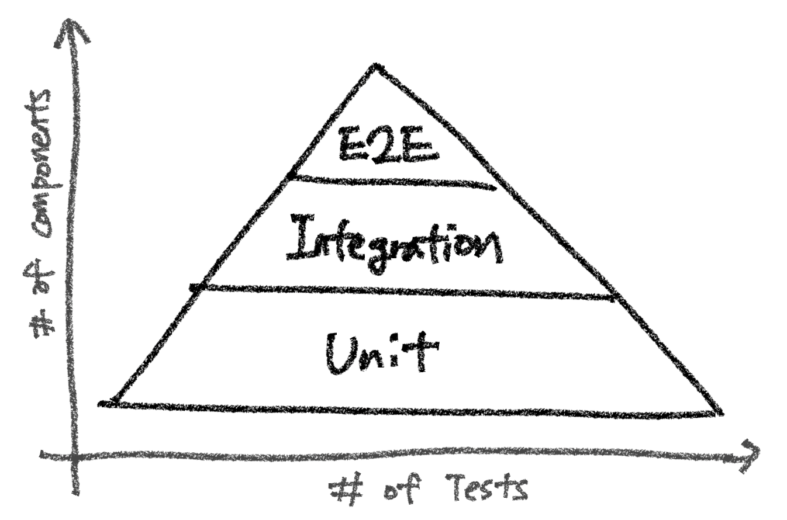
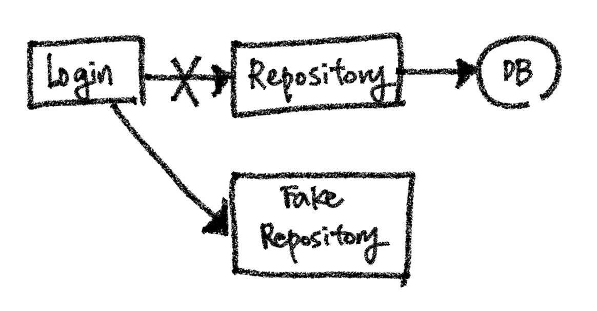

# 테스트 기본 개념 짚고가기

개발을 하다보면 테스트라는 말을 종종 듣습니다. 테스트는 정확히 어떤 것이며, 어떻게 하는걸까요? 이번 글에서는 테스트의 기본 개념에 대해 알아봅시다.

<br>

## 테스트

### 개념

테스트는 이름 그대로, 소프트웨어를 테스트하는 작업입니다. 소프트웨어에 숨겨진 버그는 없는지, 여러 명이 동시에 이용할 때에도 잘 견디는 지 등의 문제들을 꼼꼼히 점검하는 일입니다. 테스트를 거치지 않은 소프트웨어는 일반적으로 신뢰하기 어렵습니다. 실시간으로 언제 어디서 버그가 튀어나올지 모르죠.

테스트의 종류는 구글링하면 수두룩하게 나올 정도로 상황에 따라 종류가 많습니다만, 여기서는 개발을 하면서 거의 필수로 하게 되는 테스트 중심으로 소개합니다. 


### 테스트의 종류

개발자가 아마도 가장 많이 마주하게 되는 테스트는 다음 세가지 정도 입니다.



- 유닛 테스트
    - 유닛(Unit)이라는 말 그대로, 가장 작은 단위의 테스트입니다.
    - 코드의 함수, 클래스의 메서드가 잘 작동하는지 확인합니다.
    - 테스트하고자 하는 코드는 다른 외부 컴포넌트(웹 서버, DB 등)에 의존성이 없어야 합니다.
    - 가장 간단하고, 직관적이며, 빠르게 실행과 결과를 볼 수 있는 테스트입니다.
- 통합 테스트
    - 통합(Integration)이라는 말 그대로, 여러 요소를 통합한 테스트를 말합니다.
    - 데이터베이스와 연동한 코드가 잘 작동하는지, 여러 함수와 클래스가 엮여있는 로직이 잘 작동하는지 등을 확인합니다.
    - 유닛 테스트보다는 복잡하고 느리지만, 소프트웨어는 결국 여러 코드 로직의 통합이라는 점에서 통합 테스트 역시 중요합니다.
- E2E 테스트
    - E2E는 End To End의 약자로, 끝에서 끝, 즉 클라이언트 입장에서 테스트해보는 것입니다.
    - 예를 들어 쇼핑몰 웹사이트의 경우, `/login` 으로 POST 요청 시 로그인은 잘 되는지, `/order` 로 POST 요청 시 주문 결과는 잘 나오는 지 등을 확인합니다.
    - 보통 유저 시나리오에 따라 테스트합니다.
    - 테스트 중 가장 느리지만, 결국 소프트웨어를 사용하는건 유저이고, 유저 입장에서 해보는 테스트이므로, 역시 중요하다고 할 수 있습니다.

보통 테스트는 유닛 -> 통합 -> E2E 순으로 작성하게 됩니다. 작은 것부터 개발해나가는 순서와 같죠. (테스트 주도 개발이리고 불리는 TDD에서는 이와 반대로 E2E -> 통합 -> 유닛 순으로 하기도 합니다.)

테스트 개수는 가장 작은 단위 테스트인 유닛 테스트가 가장 많고, E2E 테스트가 가장 적게 됩니다. 반면, 한 번의 테스트 안에서 테스트하는 컴포넌트의 수는 E2E 테스트가 가장 많고, 유닛 테스트가 가장 적습니다.

> 유닛 테스트로 추후에 어떠한 컴포넌트의 기능이 문제가 있는지 빠르게 찾아낼 수 있습니다. 한편 통합테스트로 프로그램의 로직 흐름에 이상이 없는지를 파악할 수 있습니다. E2E 테스트는 최종적으로 사용자 관점에서 사용하기에 기능적인 문제가 없는지 진행하는 테스트로 정리할 수 있습니다.


### 테스트 코드

테스트의 종류에 대해서 얼핏 알았습니다. 이제 직접 위에서 배운 테스트를 실습해봅시다!  
그런데 어떻게 테스트를 해볼 수 있을까요?

테스트 역시 코드로 구현할 수 있습니다. 예를 들어 파이썬에는 pytest라고 하는 테스트 프레임워크가 있는데, 이를 활용하여 다음처럼 테스트를 코드로 구현할 수 있습니다. 

```python
# test_example.py

# 테스트 대상이되는 함수입니다.
def add(a: int, b: int) -> int:
    return a + b

# 테스트를 시행할 코드입니다.
def test_add():
    assert add(1, 1) == 2  # add(1, 1)의 출력이 2면 테스트를 통과합니다.
```

이제 셸에서 `pytest {파일 이름}` 명령어로 위에서 작성한 테스트 코드를 실행시킬 수 있습니다.

```bash
$ pytest test_example.py

========================== test session starts ==========================
platform darwin -- Python 3.8.7, pytest-6.2.5, py-1.10.0, pluggy-1.0.0 -- 
cachedir: .pytest_cache
collected 1 item                                                                                                                                                                               

test_example.py::test_add PASSED  # 테스트 통과에 성공했습니다.
```

`add(1, 1)` 의 출력이 `2` 였기 때문에 테스트가 통과했습니다.  
만약 출력 값을 `2` 가 아니라 `3` 이랑 같은지 비교하면 어떻게 될까요? 코드를 수정해봅시다.

```python
# test_example.py

def add(a: int, b: int) -> int:
    return a + b

def test_add():
    assert add(1, 1) == 3  # 2 -> 3으로 수정
```

그리고 다시 다음처럼 `pytest` 명령어를 실행합니다.

```bash
$ pytest test_example.py      

========================== test session starts ==========================
platform darwin -- Python 3.8.7, pytest-6.2.5, py-1.10.0, pluggy-1.0.0
collected 1 item                                                                                                                                                                               

test_example.py F  # 테스트 통과에 실패했습니다.                                                                                                                                              [100%]

========================== FAILURES ==========================
========================== test_add ==========================

    def test_add():
>       assert add(1, 1) == 3
E       assert 2 == 3
E        +  where 2 = add(1, 1)

test_example.py:6: AssertionError
========================== short test summary info ==========================
FAILED test_example.py::test_add - assert 2 == 3
========================== 1 failed in 0.03s ==========================
```

이번에는 `F (Fail)` 값을 내며 테스트가 실패했다고 나옵니다. 코드의 어느 부분에서 테스트가 실패했는지에 대한 정보가 나옵니다.

이처럼 테스트 역시 코드로 구현할 수 있습니다. 이렇게 테스트를 구현하는 코드를 "테스트 코드"라고 부릅니다.


### 테스트 코드가 필요한 이유

테스트 코드는 테스트를 실행하기 위해 필요합니다. 하지만 테스트 코드는 단순히 테스트 실행말고도 다음처럼 더 큰 의미들이 있습니다. 

- 테스트 코드는 테스트해보고자 하는 코드가 동작하기 위해 필요한 것들과 입/출력을 드러냅니다.
    - 테스트 코드는 테스트하고자 하는 코드의 클라이언트 중심으로 짜지게 됩니다. 즉 테스트하고자 하는 코드를 사용하려면 어떤 의존성이 필요한지, 어떤 입력을 주면 어떤 출력을 뱉는지 테스트 코드를 보면 알 수 있습니다.
    - 따라서 테스트 코드는 코드에 대한 일종의 문서화 기능을 합니다. 테스트 코드만 보면, 코드를 돌리는데 필요한 것들을 알 수 있기 때문입니다.
    - 이런 맥락에서, 누군가 개발한 코드를 볼 때 테스트 코드를 먼저 보면 로직을 파악하는데 도움이 많이 됩니다. 테스트 코드는 이렇게 다른 개발자들을 위한 일종의 배려이기도 합니다.
- 테스트 코드는 리팩토링과 지속적인 개발을 위해 필수적입니다.
    - 테스트 코드가 없이 개발을 계속해서 해나가면, 추가로 개발한 코드가 기존 코드의 어떤 사이드 이펙트를 불러일으키는 지 확인하기 어렵습니다.
    - 테스트 코드를 만들어두면, 추가로 코드를 개발할 때마다, 기존 테스트 코드를 모두 실행함으로써 기존 코드의 작동 여부에 사이드 이펙트가 있는 지 빠르게 확인할 수 있습니다.
    - 이런 맥락에서, 테스트 코드는 일종의 안전망입니다. 테스트 코드 없이 개발을 계속 해나가면 매번 리팩토링과 기능 개발을 할 때마다 마음을 졸이게 됩니다.

<br>

## 테스트 코드 작성하기

이제 테스트 코드에 대해 알았으니, 파이썬으로 유닛, 통합, E2E 테스트를 테스트 코드로 작성해봅시다.  
간단한 시나리오를 생각해보죠. 우리는 간단한 쇼핑몰 웹 사이트의 백엔드 서버에서 로그인 기능을 개발하고 있다고 합시다. 

### 유닛 테스트

로그인 기능에는 다음처럼 로그인 인증을 마친 유저에게 응답으로 줄 토큰을 생성하는 함수를 사용합니다.

```python
def create_token(user_id: str) -> str:
    return user_id + "_verified"
```

> 물론 실제로 토큰 발급을 절대 위와 같이 하지 않습니다. 코드 예제를 심플하게 가져가기 위해서 간략히 표현했습니다.

유닛 테스트는 간단한 함수나 메서드에 대해 입출력의 결과가 옳게 나왔는지 확인하는 테스트라고 했습니다. 위 함수는 유닛 테스트하기 좋은 대상입니다. 다음처럼 유닛 테스트 코드를 작성해볼 수 있습니다.

```python
def test_create_token():
    actual = create_token("grab")
    expected = "grab_verified"
    assert actual == expected
```


### 통합 테스트

로그인 기능에는 다음처럼 로그인 로직을 진행하는 함수를 사용합니다.

```python
def login(user_id: str, user_password: str) -> str:
    user_repository = UserRepository()  # DB와 연동되어 User 정보를 저장하고 불러오는 객체
    user = user_repository.find_by_id(user_id)
    if user_id == user.id and user.password == user_password:
        return create_token(user_id)
    else:
        raise Exception("로그인 인증에 실패했습니다.")
```

통합 테스트는 여러 요소를 통합한 프로세스를 검증하는 테스트라고 했습니다. `login()` 함수는 `user_repository` 와 `create_token()` 에 의존하고 있는 통합 프로세스 로직을 가진 함수입니다. 이제 이 함수에 대해 다음처럼 통합 테스트 코드를 작성해볼 수 있습니다.

```python
def test_login_successful():
    # given
    user_id = "grab"
    user_password = "1234"
    
    # when
    actual = login(user_id, user_password)
    
    # then
    assert actual == "grab_verified"
    
    
def test_login_failed():
    # given
    user_id = "grab"
    user_password = "wrong password"
    
    # when & then
    with pytest.raises(Exception):
        login(user_id, user_password)
```

위 코드가 성공하려면 `login()` 함수 내부의 `UserRepository` 인스턴스와 `create_token()` 함수 역시 잘 작동해야 합니다. 이처럼 통합 테스트는 의존성 있는 객체들의 정상 작동 여부까지 포함하는 테스트입니다.

> 당연한 말이지만, 통합, E2E 테스트는 실제 운영 환경과 별도의 테스트 환경에서 진행되어야 합니다. 예를 들어, 테스트 코드를 실행할 때 운영 DB에 연동하면 안되겠죠. 
>
> 보통 이런 테스트 환경 구축으로 Docker-compose를 사용하곤 합니다. 테스트를 실행할 동안에 사용할 DB, 혹은 웹 서버 등 재현가능한 외부 의존성은 Docker-compose로 실행한 뒤 통합/ E2E 테스트를 진행하는 것이죠. 이처럼 통합 테스트에는 테스트 환경 구축이라는 오버헤드가 있습니다.
>
> 한편 재현 불가능한 외부 의존성 (외부 API 서버 등)은 페이크 더블로 대체하곤 합니다. 페이크 더블에 대해서는 아래에서 다룹니다.


### E2E 테스트

실제로 유저는 HTTP 요청으로 로그인 요청을하게 됩니다. 따라서 애플리케이션은 다음과 같은 웹 인터페이스를 제공해야 합니다.

```python
from fastapi import FastAPI

app = FastAPI()

class LoginRequest(BaseModel):
    id: str
    password: str

@app.get("/login")
def login_endpoint(req: LoginRequest):
    token = login(user_id=req.id, user_password=req.password)
    return {
        "token": token
    }
```

E2E 테스트는 최종 사용자 입장에서의 테스트라고 했습니다. 다음처럼 서버를 `localhost:8000` 에 실행시킨 상황이라고 생각하고, 서버에 요청을 로그인 요청을 보내고 응답받는 테스트 코드를 작성합니다.

```python
import requests

def test_login_endpoint():
    # given
    api_host = "localhost:8000"
    payload = {
        "id": "grab",
        "password": "1234"
    }
    
    # when
    res = requests.post(url=f"{api_host}/login", json=payload)
    
    # then
    assert res.data() == {
        "token": "grab_verified"
    }
```

위 테스트 코드가 성공하려면 `localhost:8000` 에 실행한 서버가 잘 작동되어야 합니다. 이처럼 E2E 테스트는 서버 내부 동작은 전혀 관여하지 않은 채, 철저히 엔드 유저 입장에서 서버를 이용하는 시나리오대로 테스트해보는 것입니다.

<br>

## 테스트 더블

### 기존 테스트의 문제

테스트 더블은 테스트할 로직에서 의존하고 있는 객체를 대체해주는 객체입니다.  
위의 예시 코드 중 `login()` 함수 내 로직을 다시 보죠.

```python
def login(user_id: str, user_password: str) -> str:
    user_repository = UserRepository()  # DB와 연동되어 User 정보를 저장하고 불러오는 객체
    user = user_repository.find_by_id(user_id)
    if user_id == user.id and user.password == user_password:
        return create_token(user_id)
   	else:
        raise Exception("로그인 인증에 실패했습니다.")
```

위 코드는 `UserRepository` 객체를 의존하고 있습니다. `UserRepository` 객체는 DB와 연결을 맺어 데이터를 저장하고, 불러오는 객체로 DB가 먼저 실행된 상태여야 정상적으로 작동합니다. 즉 `UserRepository` 객체는 외부 DB에 의존성이 있습니다.

따라서 위 `login()` 함수를 정상적으로 테스트하려면 DB가 어딘가에 실행된 상태여야 하고, `UserRepository` 역시 문제 없이 잘 작동하는 상태여야 합니다. 이처럼 로직이 다른 객체들과 외부 컴포넌트(DB 등)을 의존하게 되면 테스트를 실행하는데 신경써야 할 것들이 생기게 됩니다. 단적으로 DB가 어딘가에서 실행되어 있지 않으면 위 테스트 코드를 정상적으로 실행시킬 수 없습니다.


### 테스트 더블 적용하기

테스트 더블은 이런 의존성 객체들을 "대체"함으로써 테스트를 좀 더 원활하게 진행하게 위한 객체입니다.  
예를 들어 위에서 `UserRepository` 객체는 테스트 코드에서 다음과 같은 `FakeRepository` 라는 테스트 더블로 대체할 수 있습니다.

```python
class FakeRepository:
    """ DB를 이용하지 않고, 인메모리로 데이터를 저장하고 불러냅니다."""
    
    def __init__(self, data: Dict[str, User]) -> None:
        self._data = data
        
    def find_by_id(id: str) -> Optional[User]:
        return self._data.get(id, None)
```

`login()` 함수를 좀 더 테스트하기 쉽게 만들기 위해, 의존하는 객체를 함수 내부에서 직접 생성하지 않고, 외부에서 파라미터로 주입받도록 수정합니다.

```python
def login(user_id: str, user_password: str, repository) -> str:  # repository 파라미터를 추가합니다.
    user = repository.find_by_id(user_id)
    if user_id == user.id and user.password == user_password:
        return create_token(user_id)
   	else:
        raise Exception("로그인 인증에 실패했습니다.")
```

이제 테스트 코드는 다음처럼 `FakeRepository` 를 이용하여 작성할 수 있습니다.

```python
def test_login_successful():
    # given
    repository = FakeRepository(data={  # 테스트 더블 객체를 만듭니다.
        "grab": {
            "id": "grab",
            "password": "1234"
        }
    })
    user_id = "grab"
    user_password = "1234"
    
    # when
    actual = login(user_id, user_password, repository)  # 테스트 더블 객체를 주입합니다.
    
    # then
    assert actual == "grab_verified"
```



이제 테스트 코드는 DB에 대한 의존성이 없는 상태로 테스트가 가능합니다. 

> ***테스트 더블의 종류**
>
> 테스트 더블에도 다음과 같은 종류가 있습니다.
>
> - **dummy**
>     - 실제 내부 동작은 구현하지 않은 채, 객체의 인터페이스만 구현한 테스트 더블 객체
>     - 메서드가 동작하지 않아도 테스트에 문제가 없을 때 사용합니다.
> - **fake**
>     - 동작의 구현은 갖추고 있지만, 테스트에서만 사용할 수 있는 테스트 더블 객체
>     - 대체할 객체가 복잡한 내부 로직이나 외부 의존성이 있을 때 사용합니다.
> - **stub**
>     - dummy 테스트 더블 객체에서 테스트에 필요한 최소한의 구현만 해둔 테스트 더블 객체
>     - 테스트에서 호출될 요청에 대해 미리 준비해둔 결과만을 반환합니다.
> - **spy**
>     - stub에서 테스트에 필요한 정보를 기록해두는 테스트 더블 객체
>     - 실제로 내부가 잘 동작했는지 등을 별도의 인스턴스 변수로 기록해둡니다.
> - **mock**
>     - 테스트에 필요한 인터페이스와 반환 값을 제공해주는 객체
>     - 다른 테스트 더블과 다르게 객체를 직접 정의하지 않고, 보통 `Mock` 객체로 반환 값을 미리 지정해둡니다.
>
> 참고로 위 예시코드에서 우리가 사용한 테스트 더블은 fake 타입입니다. 

<br>

## 참고

- https://tecoble.techcourse.co.kr/post/2020-09-19-what-is-test-double/
