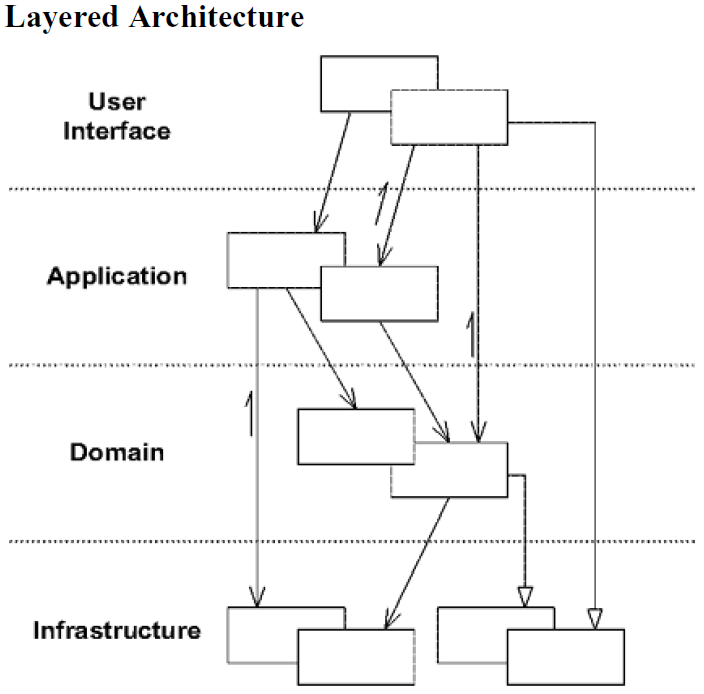

# 대표적인 아키텍처 패턴 알아보기 - 레이어드 아키텍처

여기에서는 가장 유명하고 대표적인 아키텍처들에 대해서 소개합니다. 

- 레이어드 아키텍처
- 포트 앤 어댑터 아키텍처
- 클린 아키텍처

레이어드 아키텍처부터 클린 아키텍처 순으로 알아보도록 하곘습니다. 이번 강의에는 가장 대표적인 아키텍처 패턴인 레이어드 아키텍처에 대해 알아보겠습니다. 

## 개념

레이어드 아키텍처는 많은 분야에서 사용되는 아키텍처입니다.  
이름 그대로 여러 레이어를 분리하여 레이어마다 해야 할 역할을 정의해놓은 구조입니다.



대표적인 레이어드 아키텍처인 4 Layered 의 각 Layer를 정리하면 아래와 같습니다. 

-   **프레젠테이션 레이어**
    -   인터페이스와 애플리케이션이 연결되는 곳
    -   웹 통신 프레임워크, CLI 등 인터페이스, 입출력의 변환 등 외부와의 통신을 담당합니다.
-   **애플리케이션 레이어**
    -   소프트웨어가 제공하는 주요 기능(유스케이스)를 구현하는 코드가 모이는 곳
    -   로직을 오케스트레이션하고, 트랜잭션의 시작과 끝을 담당합니다.
-   **도메인 레이어**
    -   도메인과 관련된 객체들이 모이는 곳
    -   도메인 모델(엔티티, 값 객체), 도메인 서비스 등 도메인 문제를 코드로 풀어내는 일을 담당합니다.
-   **인프라스트럭처 레이어**
    -   다른 레이어을 지탱하는 기술적 기반을 담은 객체들이 모이는 곳
    -   DB와의 연결, ORM 객체, 메시지 큐 등 애플리케이션 외적인 인프라들과의 어댑터 역할을 담당합니다.

레이어형 아키텍처는 의존성의 방향이 다음처럼 흐릅니다.

```
프레젠테이션 레이어 -> 애플리케이션 레이어 -> 도메인 레이어 -> 인프라스트럭처 레이어
```

 즉 프레젠테이션 레이어에 있는 코드는 애플리케이션 레이어에 있는 코드에 의존해야 합니다. 그 반대인 애플리케이션 레이어 코드가 프레젠테이션 레이어에 있는 코드에 의존하면 안됩니다. 이처럼 의존성의 흐름은 항상 프레젠테이션 레이어에서 인프라스트럭쳐 레이어로 흘러야 합니다.

:::tip
위는 4개의 레이어로 구성한 예이고, 3개의 레이어로 구성할 수도 있습니다. 3 티어의 경우 보통 다음처럼 구성합니다.

프레젠테이션 레이어 -> 애플리케이션 레이어 -> 데이터 접근 레이어
:::


## 예시

간단한 예를 살펴보겠습니다.  
쇼핑몰 웹 서비스의 백엔드 서버를 만든다고 해보죠. 프로젝트 구조는 다음과 같이 구성할 수 있습니다.

```
src/
  presentation_layer/
    product_controller.py
    user_controller.py
  application_layer/
    product_service.py
    user_service.py
  domain_layer/
    product.py
    user.py
  infrastructure_layer/
  	repositories/
  	  product_repository.py
  	  user_repository.py
    database.py
    orm.py
```

프로젝트 최상단에서 디렉토리로 레이어를 구분합니다. 그리고 각 디렉토리 내에서 해당 레이어에 들어갈 컴포넌트들을 배치합니다.

각 레이어에 속하는 컴포넌트들을 살펴봅시다. 

### 프레젠테이션 레이어

```python
# src/presentation_layer/product_controller.py

"""
REST API 형태로 클라이언트에게 입력을 받고, 이를 애플리케이션 서비스가 활용할 수 있는 형태로 바꾸어 전달합니다.
애플리케이션 서비스가 결과를 내놓으면 이를 REST API 에서 약속한 형태로 변환하여 클라이언트에게 HTTP 통신으로 반환합니다.
"""

from fastapi import FastAPI
from src.presentation_layer.web import app
from src.application_layer import product_service
        
@app.post("/products", status_code=200)
def register_products(json_req) -> None:
    product = product_service.create_product(name=json_req.name, price=json_req.price)
    response = {
        "product": product
    }
    return response
```

### 애플리케이션 레이어

```python
# src/application_layer/product_service.py

"""
프레젠테이션 레이어에서 넘겨받은 입력을 비즈니스 로직에 맞게 처리합니다. 
이런 처리 로직을 서비스라고 하는데, 필요에 따라 도메인 모델을 만들고, 저장소에 저장하는 등 여러 세부적인 로직을 오케스트레이션 합니다.
이후 다시 프레젠테이션 레이어에게 처리한 결과를 넘겨줍니다.
"""

from src.domain_layer.product import Product
from src.infrastructure_layer.database import db
from src.infrastructure_layer.repositories.product_repository import ProductRepository

def create_product(name: str, price: str) -> bool:
    try:
        product = Product(name, price)
        with db.Session() as session:
            product_repository = ProductRepository(session)
            product_repository.save(product)
            session.commit()
        return product
    except:
        raise Exception("Product Not Created")
```

### 도메인 레이어

```python
# src/domain_layer/product.py

"""
도메인 레이어은 도메인의 내용들을 표현합니다.
"""

from sqlalchemy import Column, String, Integer
# DB와 연결하는 일은 인프라스트럭처 레이어에서의 일입니다.
from src.infrastructure_layer.database import Base  

# 도메인 레이어의 컴포넌트(Product)는 인프라스트럭쳐 레이어의 컴포넌트(Base)에 의존합니다.
class Product(Base):
    __tablename__ = 'product'
    
    id = Column(Integer, primary_key=True)
    name = Column(String)
    price = Column(Integer)
```


## 장점

위에서 각 레이어에 포함된 코드들의 일부만 간략히 살펴보았습니다. 이렇게 레이어드 아키텍처 형태로 구성하면 좋은 점은 무엇일까요?

- 각 레이어마다 정해진 역할이 있습니다. SRP(단일 책임 원칙)와 비슷하게 레이어 간의 책임을 두고 분리시켜서 유지보수 및 코드 관리가 용이합니다.
- 레이어 간의 의존 흐름의 방향이 바깥쪽(프레젠테이션 레이어)에서 안쪽(인프라스트럭쳐 레이어)로 일정합니다. 새로운 기능을 개발할 때 통일된 흐름에 맞게 빠르게 개발이 가능합니다.   
- 개발자 뿐만 아니라, 코드를 처음 보는 사람 역시 의존성의 흐름에 따라 자연스럽게 전체적인 구조를 쉽게 파악할 수 있습니다.

## 문제점

다만 레이어드 아키텍처의 문제점이 있는데, 바로 **소프트웨어가 최종적으로 인프라스트럭처(ex. DB)에 의존성을 갖는다는 것입니다.**   

```
프레젠테이션 레이어 -> 애플리케이션 레이어 -> 도메인 레이어 -> 인프라스트럭쳐 레이어
```


소프트웨어에서 중요한 부분은 비즈니스 로직을 처리하는 "어플리케이션 레이어"와 "도메인 레이어"일 것입니다.   
그런데 도메인 레이어가 인프라스트럭쳐, 특히 DB를 의존하게 된다면 어떻게 될까요? 도메인 레이어와 어플리케이션 레이어가 변경에 쉽게 영향을 받을 수 밖에 없습니다.

DB가 도메인 즉 소프트웨어의 설계 핵심에 영향을 미치다보니, **소프트웨어의 모든 구조가 DB 중심의 설계가 됩니다.** 
이렇게 되면 애플리케이션 설계에 앞서 데이터베이스를 먼저 선택하고, 데이터베이스 설계(데이터 모델링)부터 하게 됩니다.
또한 객체지향에서 추구하는 "액션"이 먼저가 되는 것이 아니라 "상태" 중심적으로 설계를 하다보니, 점점 객체지향에서 벗어나는 코드들이 생기게 됩니다. 
