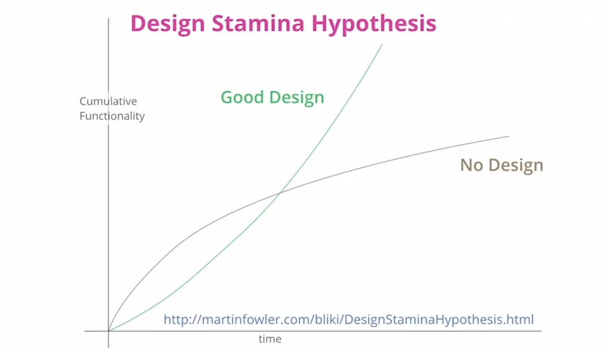

# 아키텍처를 시작하기 전에

## 소프트웨어 아키텍처란 
소프트웨어 개발 관점에서 아키텍처는 소프트웨어의 전체적인 구조를 잡아주는 설계도입니다.

아키텍처는 소프트웨어의 큰 그림을 보게 해줍니다. 좋은 아키텍처는 사람이 세부적인 코드를 일일이 다 보지 않아도, 일관된 코드 구조로 흐름을 쉽게 유추할 수 있도록 합니다.   
또한 개발을 하다 보면 코드를 어떻게 분리하고 모듈화할지, 객체를 어떻게 설계할지 고민하곤 하는데, 아키텍처는 이러한 고민에 뱡향을 제시해주는 일종의 지침이라고도 볼 수 있습니다.

몇몇 유명한 아키텍처들은 자주 사용되며 패턴화되기도 하는데, 한 번쯤 들어봤을 만한 레이어드 아키텍처, MVC 패턴 등이 바로 이렇게 패턴화된 아키텍처입니다. 

<br>

## 아키텍처가 없다면

먼저 아키텍처가 없이 개발을 진행한 프로젝트 구조의 예시를 봅시다.

```
project/
  dependency.py
  model.py
  main.py
```

어떤가요? 이 프로젝트가 어떤 프로젝트인지 조금의 감이라도 오시나요?  

위처럼 아키텍처가 없는 프로젝트들은 다음과 같은 문제점이 있습니다.

- 본인이 작성한 코드나 모듈을 프로젝트 어디에 두어야 할지 모릅니다. 고민하거나 결정하는 데 시간이 듭니다.  
- 본인이 생각한 기준과 다른 팀원이 생각한 기준이 다를 수 있습니다. 모듈 위치나 이름이 일관성 없게 됩니다.  
- 폴더, 파일 간의 의존 관계가 복잡해지면서 컴포넌트를 나누기가 힘들어집니다.    
- 팀에 새로 들어온 사람이 프로젝트 코드를 보면, 어디서부터 어떻게 봐야 할지 감이 오지 않습니다. 전체적인 흐름과 설계를 이해하는 데 시간이 오래 걸립니다.

특히 아키텍처 없이 지속해서 개발을 하다 보면 어느 순간 프로젝트 전반에 코드가 덕지덕지 붙어있거나, 산발적으로 로직이 흩어져있는 것을 느끼게 됩니다. 
이 시점부터는 새로운 기능을 개발하는데 시간이 더 오래 걸리기 시작합니다. 기능을 개발하려면 기존 코드를 파악해야 하는데, 기존 코드를 파악하는 게 쉽지 않기 때문입니다. 
이는 나중에 리팩토링을 할 때 더 큰 비용을 지불하게 만듭니다.



위 그래프는 유명한 엔지니어인 마틴 파울러가 언급한 내용입니다. 아키텍처 없는 개발은 초반에는 빠른 생산성을 가질 수 있지만, 개발을 지속할 수록 점차 생산성이 떨어지게 됩니다. 
하지만 아키텍처를 잘 설계해두면 이런 문제를 해결하고 생산성을 지속해서 올릴 수 있습니다.

## 아키텍처가 해주는 것

이번엔 나름의 아키텍처를 가지고 있는 프로젝트 구조를 보겠습니다.

```
project/
  main.py
  entry_point/
    cli.py
  use_cases/
    train.py
    predict.py
  model/
    image_classifier.py
```

:::tip
아키텍처는 단순히 파일을 나누는 폴더링보다 더 포괄적인 개념입니다. 즉 아키텍처를 설계하는 과정에서 자연스럽게 파일을 나누고 특징에 맞게 폴더에 들어갑니다.
:::

어떤가요? 프로젝트가 어떤 프로젝트인지 조금의 감이 오시나요?  

- 먼저 `entry_point/cli.py` 를 통해 이 애플리케이션은 CLI (Command Line Interface)를 제공해주는 것을 알 수 있습니다.
- `use_cases/` 내에 있는 모듈들을 통해, 이 애플리케이션에 `train` 과 `predict` 기능이 있음을 알 수 있습니다.
- `model/image_classifier` 를 통해, 이 애플리케이션이 이미지 분류 모델과 관련한 내용임을 알 수 있습니다.

이처럼 아키텍처를 잘 적용한다면 다음과 같은 효과를 얻을 수 있습니다. 

- 아키텍처는 시스템에 규칙을 만듭니다. 
    - 개발자들이 일관적이고 견고한 코드를 만들 수 있습니다.
    - 개발자들이 모듈 분리와 추상화에 대한 고민을 덜기 때문에 코드 생산성이 올라갑니다.
    - 아키텍처를 파악하면, 누군가 작성한 코드를 파악하거나 새로 코드를 작성하는데 빠르게 감을 잡을 수 있습니다.
- 소프트웨어의 구성을 한 눈에 파악하기 좋습니다.
    - 특히 패턴화된 아키텍처들은 개발자들 사이의 일종의 언어입니다. 
    - 이런 아키텍처들을 채택함으로써 개발자 간의 커뮤니케이션 비용을 줄일 수 있습니다.
- 좋은 아키텍처는 소프트웨어의 테스트를 쉽게 만들 수 있도록 돕습니다.
    - 테스트를 잘 만들어두면, 다음에 코드를 언제든지 바꿔도 동작에 문제가 없도록 보장받을 수 있습니다.
    - 좋은 아키텍처 - 테스트 - 소프트웨어의 지속 개발은 항상 같이 맞물리는 개념입니다.


## 트레이드오프

그렇다면 아키텍처의 도입은 항상 필요하고 항상 좋은 걸까요?

위에서 아키텍처의 장점을 말했지만, 사실 아키텍처를 도입하면 다음과 같은 어려운 점들이 따라옵니다.

- 초반에 아키텍처를 고민하고 결정하는 시간이 필요합니다. 
- 코드를 작성하거나 읽어야 할 때 알아야 될 규칙이 늘어납니다.
- 팀원 전체가 프로젝트의 아키텍처 패턴에 익숙해야 합니다.
- 전반적으로 작성해야 할 코드의 양이 늘어납니다.

프로젝트 초반부에 당장 세세한 아키텍처를 도입하는 것은 과할 수도 있습니다. 
문제 상황과 앞으로의 프로젝트 방향성이 당장 정해지지 않았다면, 먼저 기본적인 작업 흐름을 유지하면서 개발을 하고 나중에 본격적으로 아키텍처 도입을 고려해보는 것도 하나의 방법입니다.

## Tips
1. 아키텍처를 처음에 쉽게 이해하려면 '의존성' 관계에 집중해주세요. 결국 컴포넌트별로 역할을 명확하게 나누고 의존 관계를 분명히 하는 것이 핵심입니다.
   
2. 본인이 자주 사용하는 언어 프레임워크와 아키텍처 패턴을 구글링해서 다른 사람들은 어떻게 구현하는지 알아보고 적용해보는 걸 추천드립니다.  
  ex) react with layered architecture, spring with clean architecture 

