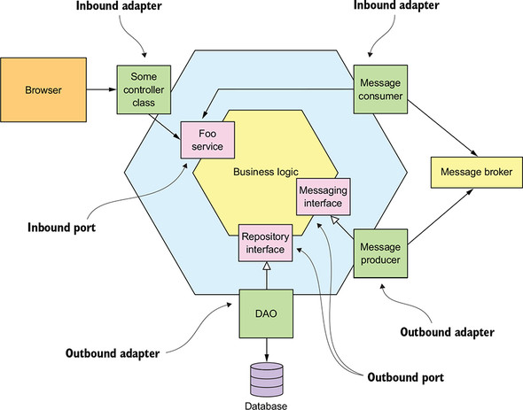

# 대표적인 아키텍처들 알아보기 - 헥사고날 아키텍처

## 개념

위에서 소개한 레이어드 아키텍처의 문제점을 해결할 수 있는 방안으로 떠오른 아키텍처입니다. 흔히 육각형의 이미지로 소개되는데, 애플리케이션과 그 외 모듈들을 자유롭게 탈착 가능하게 하는 것이 주요 컨셉입니다.

"탈착 가능하다"의 개념은 플레이스테이션 같은 게임기를 생각해보면 좀 와 닿을 것 같습니다.  
게임기에서 가장 중요한 부분은 게임을 실행시키는 본체입니다. 게임기에 연결된 입력 패드나, 게임 화면을 보여주는 모니터는 게임기 본체의 포트와 맞는 규격이면 언제든지 사용자 취향에 따라 바뀔 수 있습니다. 따라서 중요한 것은 게임기 본체 그 자체이고, 그 외부적인 것들은 언제든지 탈부착이 가능하므로, 덜 중요한 것이라고 볼 수 있습니다.

헥사고날 아키텍처의 핵심도 바로 이와 같습니다. 가운데 애플리케이션을 중심으로 애플리케이션 외의 모듈은 애플리케이션에서 제공하는 포트 모양에 맞다면 언제든 바꿀 수 있도록 하는 것입니다.



(출처: https://livebook.manning.com/book/microservices-patterns/chapter-2/53)

헥사고날 아키텍처는 어댑터가 포트 모양만 맞으면 동작하는 것 같다고 해서 포트 앤 어댑터(Ports-and-Adapters)라고 부르기도 합니다. 즉 포트만 맞으면, 어떤 어댑터든 이 포트에 끼울 수 있습니다.  

이제 헥사고날 아키텍처의 개념을 다음처럼 정리해볼 수 있습니다.

- 도메인
    - 레이어드 아키텍처에서의 도메인 레이어 개념과 같습니다.
    - 애플리케이션의 핵심이 되는 도메인을 표현합니다.
- 애플리케이션
    - 도메인을 이용한 애플리케이션의 주요 기능사항을 제공합니다.
    - 보통 `Service` 라는 단어로 표현합니다.
    - 애플리케이션은 "포트"를 가지고 있습니다.
        - 포트는 외부 어댑터를 끼울 수 있는 인터페이스 입니다.
        - 위 플레이스테이션 예시에서 게임기 본체가 애플리케이션이고, 본체에 있는 입출력, 혹은 모니터 단자를 끼울 수 있는 포트가 여기서 말하는 "포트"라고 이해하면 쉽습니다.
        - 애플리케이션으로 흐름이 들어오는 포트는 인바운드 포트, 애플리케이션에서 흐름이 나가는 포트는 아웃바운드 포트라고 합니다.
        - 포트는 프로그래밍 문법에서 인터페이스로 구현할 수 있습니다.
- 어댑터
    - 애플리케이션 내에 있는 포트에 끼울 수 있는 구현체입니다.
    - web이나 cli 등은 인바운드 포트에 끼울 수 있는 인바운드 어댑터입니다.
    - db등은 아웃바운드 포트에 끼울 수 있는 아웃바운드 어댑터입니다.
    - 어댑터는 보통 포트를 나타내는 인터페이스를 상속받아 구현합니다.

헥사고날 아키텍처에서 레이어 의존성이 다음처럼 흐릅니다.

```
어댑터 -> 애플리케이션 -> 도메인
```

의존성 흐름은 규칙입니다. 이 흐름을 역행하면 안됩니다. 예를 들면, 비즈니스 로직 -> 어댑터로, 도메인 -> 어댑터로 흐르는 의존성이 없어야 합니다.


## 예시

헥사고날 아키텍처를 프로젝트 구조로 표현하면 다음과 같습니다.

```
src/
  adapter/
    inbound/
      web/
        product_controller.py
        user_controller.py
    outbound/
      database.py
      orm.py
      repositories/
        product_repository.py
  	    user_repository.py
  application/
    service/
      product_service.py
      user_service.py
    port/
      inbound/
        product_port.py
        user_port.py
      outbound/
        product_repository.py
        user_repository.py
  domain/
    product.py
    user.py
```

먼저 프로젝트 최상단에서 크게 어댑터, 애플리케이션, 도메인으로 레이어를 디렉토리로 나눕니다. 그리고 각 디렉토리 내에 해당 레이어에 포함되는 컴포넌트들을 배치시킵니다.

레이어드 아키텍처에서는 다음처럼 서비스 레이어에 있는 모듈이 인프라스트럭쳐에 있는 모듈을 사용할 수 있었습니다.  

```python
# src/application_layer/product_service.py

from src.domain_layer import product
from src.infrastructure_layer.database import db
from src.infrastructure_layer.repositories import product_repository

def create_product(name: str, price: str) -> bool:
    ...
    product_repository = product_repository.ProductRepository(session)
    ...
```

그러나 헥사고날 아키텍처에서는 이런 흐름은 금지되므로, 다음처럼 코드를 수정해야 합니다.

```python
# src/application/service/product_service.py

from src.domain import product
from src.applicaiton.port.outbound import product_repository  # 이 부분이 수정되었습니다!
# 이제 애플리케이션 레이어는 인프라스트럭쳐 레이어에 의존하지 않습니다!

def create_product(name: str, price: str) -> bool:
    ...
    product_repository = product_repository.ProductRepository(session)
    ...
```

포트는 다음처럼 인터페이스(추상 클래스)로 구현합니다.

```python
# src/application/port/outbound/product_repository.py

from abc import ABC, abstractmethod
from src.domain import product

class ProductRepository(ABC):
    @abstractmethod
    def save(product: product.Product) -> None:
        pass
```

그리고 이 포트를 구현한 클래스는 `src/adapter/outbound/repositories/product_repository.py` 에 구현합니다.

도메인도 마찬가지로 레이어드 아키텍처에서는 다음처럼 인프라스트럭쳐 레이어의 컴포넌트에 의존했습니다.

```python
# src/domain_layer/product.py

"""
도메인 레이어은 도메인의 내용들을 표현합니다.
"""

from sqlalchemy import Column, String, Integer
# DB와 연결하는 일은 인프라스트럭처 레이어에서의 일입니다.
from src.infrastructure_layer.database import Base  

# 도메인 레이어의 컴포넌트(Product)는 인프라 스트럭쳐 레이어의 컴포넌트(Base)에 의존합니다.
class Product(Base):
    __tablename__ = 'product'
    
    id = Column(Integer, primary_key=True)
    name = Column(String)
    price = Column(Integer)
```

이 코드도 이제 도메인이 인프라스트럭쳐에 의존하지 않게 다음처럼 바뀝니다.

```python
# src/domain/product.py

from dataclasses import dataclass

@dataclass
class Product:
    id: int
    name: str
    price: int
```

이제 인프라스트럭쳐에 이 도메인 모델의 DB 엔티티 형태를 가지고 있는 ORM 객체를 별도로 만듭니다. 이 ORM 객체가 도메인 모델을 의존합니다.

```python
# src/adapter/outbound/orm.py

from sqlalchemy import Column, String, Integer
from src.adpater.outbound.database import Base  
from src.domain.product import Product

class ProductORM(Base):
    __tablename__ = 'product'
    
    id = Column(Integer, primary_key=True)
    name = Column(String)
    price = Column(Integer)
    
    @classmethod
    def from_product(cls, product: Product) -> "ProductORM":
        return cls(id=product.id, name=product.name, price=product.price)
```


<br>

## 나가며

헥사고날 아키텍처를 통해 우리는 프로젝트의 중요한 부분(애플리케이션과 도메인)과 덜 중요한 부분(어댑터)을 구분하고, 의존성의 방향을 중요한 것으로 흐르게 해서, 덜 중요한 부분은 언제든 바꿀 수 있도록 유연하게 코드를 설계했습니다. 이전보다 어댑터, 포트 등 .. 조금 더 알아야할 것이 많아지긴 했지만 이대로라면 DB 중심 설계도 하지 않고, 코드 확장에 대해서도 언제든 열려있게 만들었습니다.

다음 글에서는 포트 앤 어댑터와 거의 비슷하지만 또 다른 아키텍처 패턴인 클린 아키텍처에 대해 소개합니다. 클린 아키텍처를 통해 아키텍처적으로 어떤 것들을 고민해야 하는지 알아보겠습니다. 

<br>

## 함께 읽어보면 좋은 글들

- [지속 가능한 소프트웨어 설계 패턴: 포트와 어댑터 아키텍처 적용하기](https://engineering.linecorp.com/ko/blog/port-and-adapter-architecture/)

