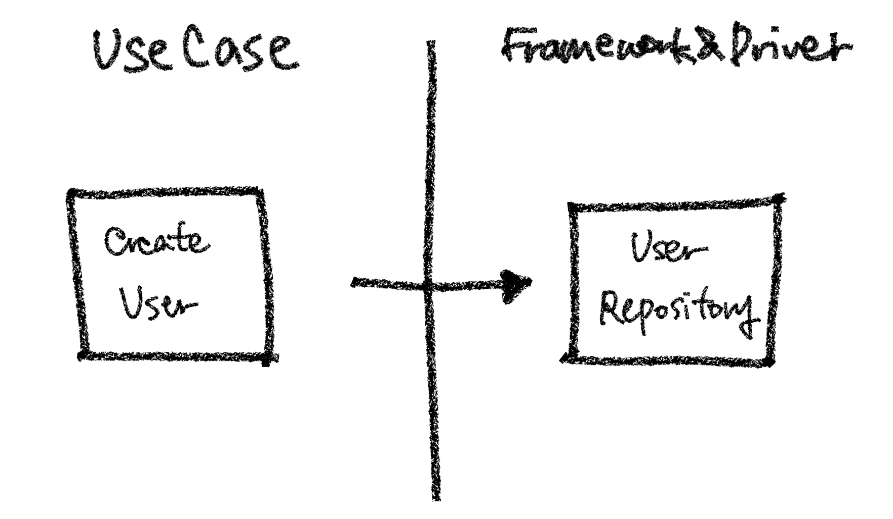
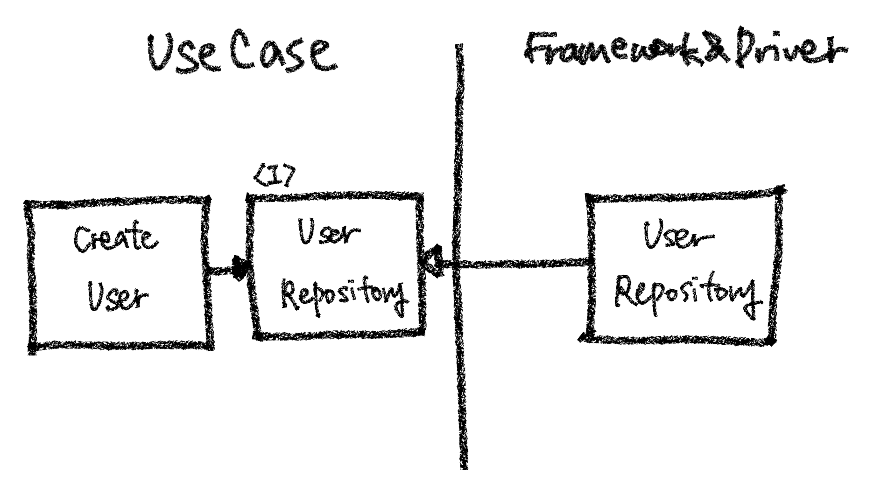

# 클린 아키텍처 - 기본

이번 시간에는 로버트 C. 마틴이 말한 클린 아키텍처의 핵심에 대해 알아보고, 이를 구현해봅시다.

 

## 개요

로버트 C. 마틴은 프로그래머들의 필독서로 권장되는 ["클린 코드"](http://www.yes24.com/Product/Goods/11681152)의 저자입니다. ["클린 아키텍처"](http://www.yes24.com/Product/Goods/77283734)는 이런 클린 코드와 비슷한 맥락으로 아키텍처의 관점에서 나온 책입니다. 아직 읽어보지 않으셨다면 읽어보시길 강력히 추천드립니다.

책에서는 아키텍처에 대해 다음과 같이 말합니다.

- 좋은 아키텍처는 시스템을 **쉽게** (**이해**하고, **개발**하며, **유지보수**하고, **배포**)할 수 있게 한다.
- 아키텍처는 시스템의 **동작 여부 자체**와는 거의 관련이 없다.
- 아키텍처는 소프트웨어를 **유연하고 부드럽게** 구조화한다.
- 좋은 아키텍트는 시스템의 **핵심적인 요소(정책이라고 한다)를 식별**하고, 동시에 **세부사항은 이 정책에 무관**하게 만들 수 있는 형태로 시스템을 구축한다.
- 좋은 아키텍트는 **세부사항에 대한 결정을 가능한 한 오랫동안 미룰 수 있는 방향으로** 정책을 설계한다.

클린 아키텍처는 이러한 내용들을 고려한 아키텍처 패턴입니다.

## 형태

앞서 소개한 아키텍처들과 마찬가지로, 클린 아키텍처 역시 관심사 단위로 레이어를 나눕니다.

(출처 : Credit: 도서출판 인사이트)

- **엔티티**
    - 핵심 업무 규칙을 캡슐화합니다.
    - 메서드를 가지는 객체 거나 일련의 데이터 구조와 함수의 집합일 수 있습니다.
    - 가장 변하지 않고, 외부로부터 영향받지 않는 영역입니다.
- **유스 케이스**
    - 애플리케이션에 특화된 업무 규칙을 포함합니다.
    - 시스템의 모든 유스 케이스를 캡슐화하고 구현합니다.
    - 엔티티로 들어오고 나가는 데이터 흐름을 조정하고 조작합니다.
- **인터페이스 어댑터**
    - 일련의 어댑터들로 구성됩니다.
    - 어댑터는 데이터를 (유스 케이스와 엔티티에게 가장 편리한 형식) <-> (데이터베이스나 웹 같은 외부 에이전시에게 가장 편리한 형식)으로 변환합니다.
    - 컨트롤러, 프레젠터, 게이트웨이 등이 여기에 속합니다.
- **프레임워크와 드라이버**
    - 시스템의 핵심 업무와는 관련 없는 세부 사항이다. 언제든 갈아 끼울 수 있습니다.
    - 프레임워크나, 데이터베이스, 웹서버 등이 여기에 해당됩니다.

레이어는 상황에 따라 4가지 이상일 수 있습니다.

핵심은 안쪽 영역으로 갈수록 추상화와 정책의 수준이 높아지고, 반대로 바깥쪽 영역으로 갈수록 구체적인 세부사항으로 구성된다는 것입니다. 안쪽 영역을 갈수록 고수준이라고 하며, 바깥쪽으로 갈수록 저수준이라고 합니다.

## 의존 방향 규칙

의존성 방향은 항상 저수준에서 고수준으로 흘러야 합니다. 즉 바깥쪽 원에서 안쪽 원으로 의존성이 있어야 한다는 것입니다. 반대로 고수준에서 저수준으로 의존성이 흐르면 안됩니다. 안쪽 원은 바깥쪽 원의 어떤 것도 알지 못해야 합니다.

그러나 실제로 애플리케이션이 동작할 때는 제어 흐름은 이런 의존 흐름과는 반대입니다. 예를 들어, "유저 생성하기" 서비스는 유저를 저장하기 위해 유저 DB에 연동된 리포지터리를 사용할 것입니다. 서비스는 유즈 케이스 영역이고, DB는 프레임워크와 드라이버 영역이므로, 유즈 케이스 영역에서 프레임워크와 드라이버 영역으로 실행 흐름이 생기게 됩니다. 고수준이 저수준에 의존하고 있는 것이므로, 이는 아키텍처 의존성 규칙에 위반합니다.

클린 아키텍처에서는 이런 의존성 방향을 제어하기 위해, 의존성 역전 규칙을 활용합니다. 즉 추상화된 인터페이스를 고수준 레이어에 두고, 이 인터페이스를 사용합니다. 그리고 저수준에는 이 인터페이스를 상속받는 객체를 구현합니다. 이렇게 하면 고수준 컴포넌트가 저수준 컴포넌트에 의존하게 되지 않고, 반대로 저수준 컴포넌트가 고수준 컴포넌트에 의존하게 됩니다.

