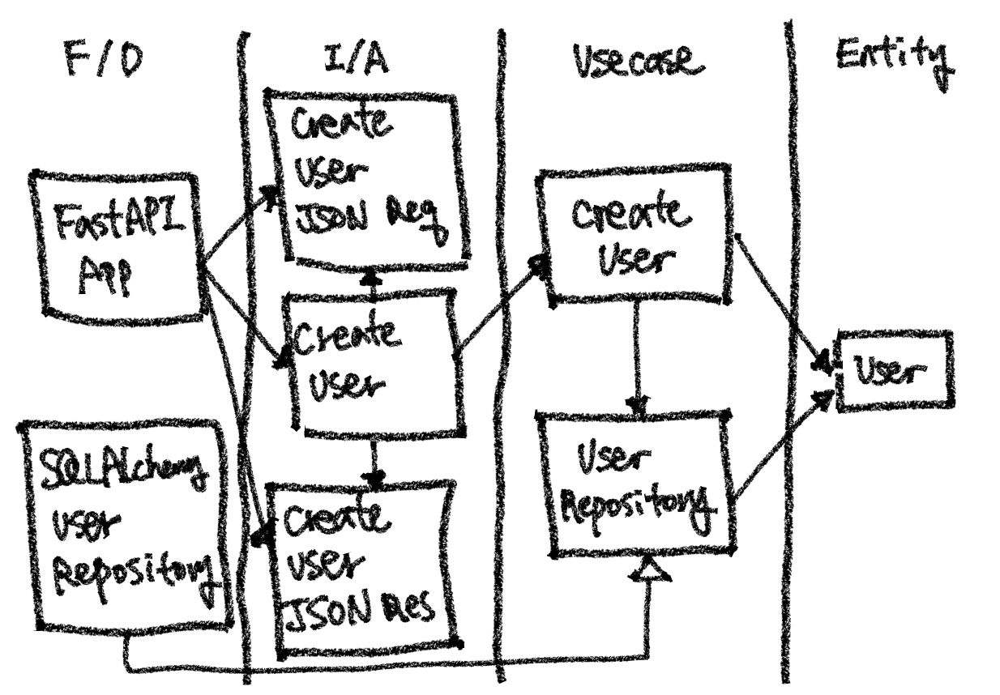

# 클린 아키텍처

이번 시간에는 로버트 C. 마틴이 말한 클린 아키텍처의 핵심에 대해 알아보고, 이를 구현해봅시다.

<br>

## 클린 아키텍처란?

### 개요

로버트 C. 마틴은 프로그래머들의 필독서로 권장되는 ["클린 코드"](http://www.yes24.com/Product/Goods/11681152)의 저자입니다. ["클린 아키텍처"](http://www.yes24.com/Product/Goods/77283734)는 이런 클린 코드와 비슷한 맥락으로 아키텍처의 관점에서 나온 책입니다. 아직 읽어보지 않으셨다면 읽어보시길 강력히 추천드립니다.

책에서는 아키텍처에 대해 다음과 같이 말합니다.

- 좋은 아키텍처는 시스템을 **쉽게** (**이해**하고, **개발**하며, **유지보수**하고, **배포**)할 수 있게 한다.
- 아키텍처는 시스템의 **동작 여부 자체**와는 거의 관련이 없다.
- 아키텍처는 소프트웨어를 **유연하고 부드럽게** 구조화한다.
- 좋은 아키텍트는 시스템의 **핵심적인 요소(정책이라고 한다)를 식별**하고, 동시에 **세부사항은 이 정책에 무관**하게 만들 수 있는 형태로 시스템을 구축한다.
- 좋은 아키텍트는 **세부사항에 대한 결정을 가능한 한 오랫동안 미룰 수 있는 방향으로** 정책을 설계한다.

클린 아키텍처는 이러한 내용들을 고려한 아키텍처 패턴입니다.


### 형태

앞서 소개한 아키텍처들과 마찬가지로, 클린 아키텍처 역시 관심사 단위로 레이어를 나눕니다.


(출처 : Credit: 도서출판 인사이트)

- **엔티티**
    - 핵심 업무 규칙을 캡슐화합니다.
    - 메서드를 가지는 객체 거나 일련의 데이터 구조와 함수의 집합일 수 있습니다.
    - 가장 변하지 않고, 외부로부터 영향받지 않는 영역입니다.
- **유스 케이스**
    - 애플리케이션에 특화된 업무 규칙을 포함합니다.
    - 시스템의 모든 유스 케이스를 캡슐화하고 구현합니다.
    - 엔티티로 들어오고 나가는 데이터 흐름을 조정하고 조작합니다.
- **인터페이스 어댑터**
    - 일련의 어댑터들로 구성됩니다.
    - 어댑터는 데이터를 (유스 케이스와 엔티티에게 가장 편리한 형식) <-> (데이터베이스나 웹 같은 외부 에이전시에게 가장 편리한 형식)으로 변환합니다.
    - 컨트롤러, 프레젠터, 게이트웨이 등이 여기에 속합니다.
- **프레임워크와 드라이버**
    - 시스템의 핵심 업무와는 관련 없는 세부 사항이다. 언제든 갈아 끼울 수 있습니다.
    - 프레임워크나, 데이터베이스, 웹서버 등이 여기에 해당됩니다.

레이어는 상황에 따라 4가지 이상일 수 있습니다.

핵심은 안쪽 영역으로 갈수록 추상화와 정책의 수준이 높아지고, 반대로 바깥쪽 영역으로 갈수록 구체적인 세부사항으로 구성된다는 것입니다. 안쪽 영역을 갈수록 고수준이라고 하며, 바깥쪽으로 갈수록 저수준이라고 합니다.


### 의존 방향 규칙

의존성 방향은 항상 저수준에서 고수준으로 흘러야 합니다. 즉 바깥쪽 원에서 안쪽 원으로 의존성이 있어야 한다는 것입니다. 반대로 고수준에서 저수준으로 의존성이 흐르면 안됩니다. 안쪽 원은 바깥쪽 원의 어떤 것도 알지 못해야 합니다.

그러나 실제로 애플리케이션이 동작할 때는 제어 흐름은 이런 의존 흐름과는 반대입니다. 예를 들어, "유저 생성하기" 서비스는 유저를 저장하기 위해 유저 DB에 연동된 리포지터리를 사용할 것입니다. 서비스는 유즈 케이스 영역이고, DB는 프레임워크와 드라이버 영역이므로, 유즈 케이스 영역에서 프레임워크와 드라이버 영역으로 실행 흐름이 생기게 됩니다. 고수준이 저수준에 의존하고 있는 것이므로, 이는 아키텍처 의존성 규칙에 위반합니다.


클린 아키텍처에서는 이런 의존성 방향을 제어하기 위해, 의존성 역전 규칙을 활용합니다. 즉 추상화된 인터페이스를 고수준 레이어에 두고, 이 인터페이스를 사용합니다. 그리고 저수준에는 이 인터페이스를 상속받는 객체를 구현합니다. 이렇게 하면 고수준 컴포넌트가 저수준 컴포넌트에 의존하게 되지 않고, 반대로 저수준 컴포넌트가 고수준 컴포넌트에 의존하게 됩니다.


<br>

## 구현 해보기

클린 아키텍처 패턴으로 간단하게 유저를 생성하는 웹 애플리케이션 로직을 파이썬으로 구현해봅시다.

### 엔티티

먼저 다음처럼 엔티티를 정의합니다. 엔티티는 도메인에 핵심을 표현하는 객체입니다.

```python
# domain/entities.py

@dataclass
class User:
    id: str
    name: str
    password: str
```


### 유즈 케이스

유즈 케이스는 엔티티를 가지고 애플리케이션에 다양하게 활용하는 유저 시나리오 입니다. 우리는 "유저 생성하기" 시나리오를 작성하고 있습니다.

```python
# application/use_cases/create_user.py

@dataclass
class CreateUserInputDto:
    user_name: str
    user_password: str

        
@dataclass
class CreateUserOutputDto:
    user_id: str
        
        
class CreateUser:
    def __init__(self, user_repository: UserRepository) -> None:
   	    # 의존성 역전을 위해 같은 레이어(applicaiton)에 있는 추상화된 UserRepository에 의존합니다.
        # 다시 말해, 인프라스트럭처에 정의될 구체적인 UserRepository 객체에 의존하지 않습니다.
        # 실제 런타임에서는 UserRepository를 상속받은 세부 클래스를 주입해야 합니다.
        # 세부 클래스는 인프라스트럭처 레이어에 정의되며, 이는 의존성 주입하는 부분에서 주입됩니다.
        self._user_repository = user_repository
    
    def execute(input_dto: CreateUserInputDto) -> CreateUserOutputDto:
        user_id = self._user_repository.get_next_user_id()
        user = User(id=user_id, name=input_dto.user_name, paassword=input_dto.user_password)
        self._user_repository.save(user)
        return CreateUserOutputDto(user_id=user_id)
```

```python
# application/interfaces/user_repository.py

class UserRepository(ABC):
    @abstractmethod
    def save(user: User) -> None:
        pass
```

> ***DTO(Data Transfer Object)란?**
>
> DTO는 말 그대로 데이터를 주고 받기 위해 사용하는 객체입니다. DTO에는 무언가 액션을 하는 메서드를 두지 않습니다. DTO는 그저 데이터를 담기만 해야합니다.  
> 보통 레이어간 의존성을 끊고, 도메인 모델을 보호하기 위해서 유즈 케이스의 입출력으로 DTO를 사용합니다. 예를 들어 위처럼 `CreateUser` 의 입출력으로 DTO를 사용하면, 이 유즈케이스를 사용하는 인터페이스 어댑터에서 도메인 모델 `User` 에 대한 의존성이 사라지게 됩니다. 만약 DTO로 전달하지 않고, `User` 를 그대로 인터페이스 어댑터에 전달하면, 인터페이스 어댑터에서 도메인 모델을 조작할 여지가 있고, 도메인 모델을 그대로 외부에 노출하는 셈입니다. 따라서 레이어간 DTO로 데이터를 주고받으며 의존성과 도메인 모델 노출을 없앨 수 있습니다.

### 인터페이스 어댑터

인터페이스 어댑터는 외부 영역과 내부 영역의 인터페이스를 변환해주는 역할을 합니다. 예를 들어 JSON 데이터를 유즈 케이스 입력으로 변환하여 유즈케이스를 실행한다거나, 유즈 케이스 출력을 JSON 데이터로 내보냅니다. 일반적으로 웹 애플리케이션에서 컨트롤러 객체가 바로 이 인터페이스 어댑터에 해당됩니다.

```python
# interface_adapter/controller/create_user.py

class CreateUserJSONRequest(BaseModel):
    name: str
    password: str

class CreateUserJSONResponse(BaseModel):
    user_id: str

def create_user(json_request: CreateUserJSONRequest) -> CreateUserJSONResponse:
    use_case = conatiner.get_usecase("create_user")
    input_dto = CreateUserInputDto(user_name=json_request.name, user_password=json_request.password)
    output_dto = use_case.execute(input_dto)
    return CreateUserJSONResponse(user_id=output_dto.user_id)
```


### 프레임워크 & 드라이버 (인프라스트럭쳐)

프레임워크 & 드라이버에는 웹서버나 DB 연동 객체 등 구체적으로 사용하는 세부 기술들이 놓이게 됩니다. 이 레이어는 인프라스트럭쳐 레이어라고도 합니다.  
여기서는 웹 인터페이스로 파이썬의 웹 프레임워크인 FastAPI를 사용하고, 리포지터리 객체의 DB와 연동은 SQLAlchemy ORM을 사용합니다.

```python
# framework_and_drvier/web.py

app = FastAPI()
router.add_api_route(
    path="/users", endpoint=create_user, methods=["POST"], status_code=201
)

if __name__ == "__main__":
    bootstar
    uvicorn.run(app)
```

```python
# framework_and_drvier/db/user_repository.py

class SQLAlchemyUserRepository(UserRepository):
    def __init__(self, session_factory: Callable[..., AbstractContextManager[Session]]) -> None:
        self.session_factory = session_factory
        
    def save(user: User) -> None:
        user_orm = UserORM.from_user(user)
        with self.session_factory() as session:
            session.add(user_orm)
            session.commit()
```


### 프로젝트 구조

```
domain/
  entities.py
application/
  use_cases/
    create_user.py
  interfaces/
    user_repository.py
interface_addapter/
  controller/
    create_user.py
framework_and_drvier/
  web.py
  db/
    user_repository.py
    datbase.py
    orms/
      user_orm.py
```


### 의존성 다이어그램



> ***주의할 점**
>
> 네이밍을 꼭 레이어 이름대로 할 필요는 없습니다. 좀 더 명확한 네이밍이나, 팀에서 협의가 된 네이밍 규칙이 있다면 그것을 쓰면 됩니다. 또한 반드시 이런 패턴으로 100% 들어맞게 하지 않아도 됩니다. 상황에 따라 레이어 개수나 레이어별 의미는 달라질 수 있습니다. 중요한 것은 레이어 의존성의 방향이 바깥쪽 레이어에서 안쪽 레이어로 흘러야 한다는 것입니다.

<br>

## 좋은 아키텍처에 대한 고민

레이어드 아키텍처부터, 포트 앤 어댑터 그리고 클린 아키텍처까지 살펴보았습니다. 이런 아키텍처 패턴이 너무 많은 코딩량을 요한다고 생각이 드셨나요? 당장 프로젝트에 도입하기에는 너무 과하다고 생각이 드셨나요?

사실 아키텍처에 정답은 없습니다. 아키텍처는 아키텍처 자체로 남는 것이 아니라, 실제로 개발자들이 쉽고 지속적인 개발을 위해 존재합니다. 아무리 깔끔해보이는 아키텍처라고 하더라도, 당장 팀에 도움이 되지 않으면 무용지물로 남을 것입니다.

"쉽고 지속적이며 생산성을 높이는 아키텍처"를 위해서라면 어떤 아키텍처든 다음을 고민해봐야 할 것입니다.

- 프로젝트, 아키텍처 구조만 보고도 애플리케이션을 쉽게 파악할 수 있는가?
- 추가 확장 및 수정사항에 용이한 구조를 가지고 있는가?
- 개발자가 어떤 모듈을 어디에 두어야할지에 대한 고민을 줄여주는가?
- 쉽게 테스트 가능한가?

이런 질문에 해답을 내놓을 수 있는 아키텍처라면, 분명 개발 생산성에도 도움을 줄 수 있는 좋은 아키텍처 일것입니다. 더 좋은 아키텍처에 대해 고민하고 연구하는 것은 이제 여러분들에게 남아있습니다!

